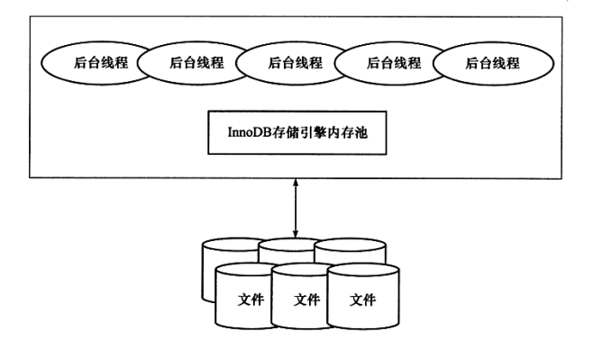
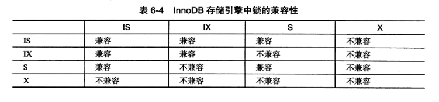
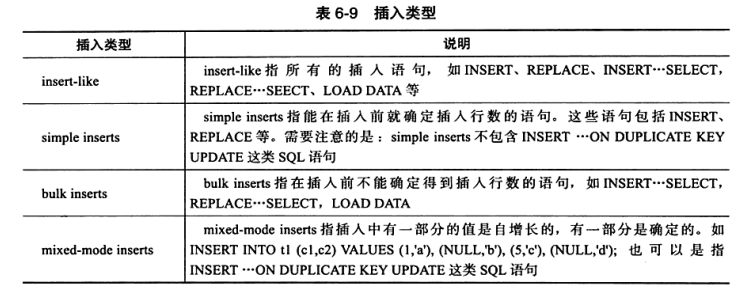
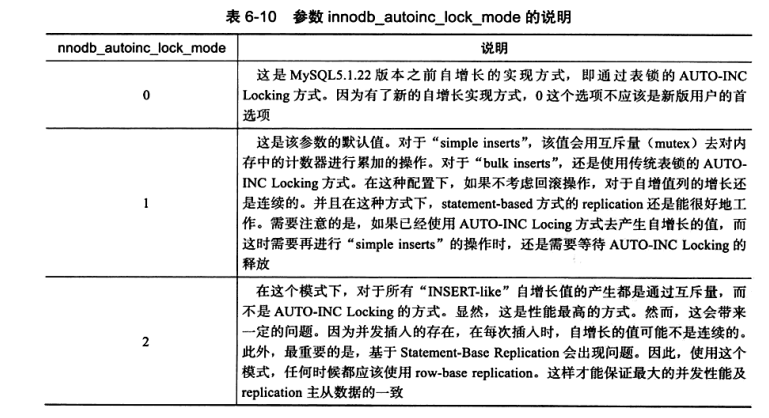
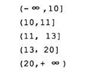
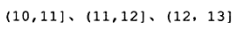
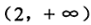
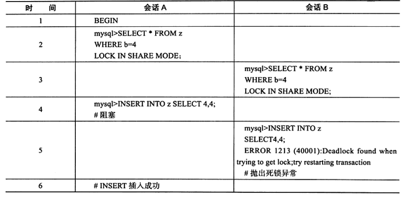

# 第2章 InnoDB存储引擎

事务安全。

## 2.1 InnoDB存储引擎概述

Mysql5.5开始是默认的表存储引擎（之前尽在Window下是）。第一个完整支持ACID事务的MySQL存储引擎。其特点是行锁设计、支持MVCC、支持外键、提供一致性非锁定读，同时被设计用来最有效地利用以及使用内存和CUP。

高性能、高可用、高扩展。

## 2.2 InnoDB存储引擎的版本

略

## 2.3 InnoDB体系结构

后台线程的主要作用是负责刷新内存池中的数据，保证缓冲池中的内存缓存的是最近的数据。

此外将已修改的数据文件刷新到磁盘文件，同时保证在数据库发生异常的情况下InnoDB能恢复到正常运行状态。

### 2.3.1 后台线程

多线程模型。不同的后台线程处理不同的任务。

1. Master Thread

将缓冲池的数据异步刷新到磁盘，保证数据一致性，包括脏页的刷新、合并插入缓冲（INSERT BUFFER）、UNDO页的回收。

2. IO Thread

大量使用AIO（Async IO），极大提高性能。IO Thread主要负责这些IO请求的回调处理。

# 第6章 锁

一个开发难点：利用数据库的并发访问，同时又要确保一致性读与写。数据库系统区别于文件系统的关进特性。

人们认为行级锁总会增加开销，实际上，只有当实现本身会增加开销时，行级锁才会增加开销。InnoDB不需要锁升级，因为一个锁和多个锁的开销时相同的。

## 6.1 什么是锁？

锁机制用于管理对共享资源的并发访问。不只是行级锁，同时会在内部其他地方使用锁。例如操作缓冲池LRU列表。

数据库系统使用锁是为了支持对共享资源进行并发访问，提供数据的完整性和一致性。

不同数据库实现对于锁的实现不同。

MyISAM引擎是表锁设计。并发情况下读没有问题，但是并发插入的性能差一些。

InnoDB存储引擎，提供一致性的非锁定读、行级锁支持。行级锁没有额外的开销，并可以同时得到并发性和一致性。

## 6.2 lock和latch

都可以被称为“锁”，但含义不同。这里主要说lock。

latch分为mutex（互斥锁）和rwlock（读写锁）。其目的是用来保证并发线程操作资源的正确性，没有死锁检测机制。

lock的对象是事务，锁定的是数据库中的对象，如表、页、行。并且一般lock的对象仅在事务commit和rollback后进行释放（不同隔离级别释放时间不同）。有死锁机制。

查看latch的命令：SHOW ENGINE INNODE MUTEX;

## 6.3 InnoDB存储引擎中的锁

### 6.3.1 锁的类型

两种标准类型的**行级锁**：

- 共享锁（S Lock）
- 排他锁（X Lock）

X锁与任何的锁都不兼容，S锁仅与S锁兼容。

InnoDB存储引擎支持多粒度锁定，允许行级锁和表级锁同时存在。为了支持不同粒度上加锁，InnoDB支持了一种额外的锁方式，意向锁（Intention Lock）。

意向锁是将锁定的对象分为多个层次，意向锁意味着事务希望再更细力度上进行加锁。

即先用意向锁锁粗粒度，最后用行级锁锁住行。

- 意向共享锁（IS Lock），事务想要获得一张表中某几行的共享锁。
- 意向排他锁（IX Lock），事务想要获得一张表中某几行的排他锁。

InnoDB支持的是行级别的锁，因此意向锁其实不会阻塞除全表扫描以外的任何请求。

lock_data不可信。当用户运行一个范围查找时，lock_data只返回第一行的主键值。

### 6.3.2 一致性非锁定读

一致性非锁定读是指InnoDB通过多版本控制的方式来读取当前执行时间数据库中行的数据。

如果读取的行正在执行DELETE或UPDATE操作，这是读取操作不会因此去等待行上锁的释放。而是去读取行的一个快照数据。

非锁定是因为不需要等待X锁地释放。快照通过undo实现，没有额外开销。而且读快照不需要上锁。

RC和RR下，InnoDB使用非锁定地一致性读。但对快照地定义不同。

RC违反了隔离性。

### 6.3.3 一致性锁定读

两种一致性锁定读操作：

- SELECT ... FOR UPDATE;
- SELECT ... LOCK IN SHARE MODE;

SELECT ... FOR UPDATE;对读取地行记录加一个X锁，其他事务不能对已锁定地行加上任何锁。

SELECT ... LOCK IN SHARE MODE;对读取的行记录加一个S锁，其他事务可以向被锁定的行加S锁，但是如果加X会被阻塞。

事务提交时锁就释放了。

### 6.3.4 自增长与锁

再InnoDB的内存结构中，对每个含有自增长值得表都有一个自增长计数器。当对含有自增长技术器得表进行插入操作时，这个计数器会被初始化，执行如下得语句来得到计数器的值：

SELECT MAX(auto_inc_col) FROM t FOR UPDATE;

插入操作将其加1。这个实现风湿称作AUTO-INC Locking。这种锁其实是采用一种特殊得表锁机制，为了提高插入得性能，锁不在事务完成后释放，而是完成对自增长得SQL语句后立即释放。

虽然AUTO-INC Locking从一定程度上提高了并发插入得效率，但还是有性能问题。事务必须等待前一个插入的完成。其次对于INSERT...SELECT 的大数量的插入会影响插入的性能，因为另一个事务中的插入会被阻塞。

=========

5.1.22之后对这部分进行了一个优化：提供了一种轻量级互斥量的自增长实现机制，这种机制大大提高了自增长插入的性能。

并且从该版本开始，InnoDB存储引擎提供了一个参数innodb_autonic_lock_mode来控制自增长，默认值为1。

自增长的插入分类图：

innodb_autoinc_lock_mode各个设置下对自增的影响：

特别注意：InnoDB的自增长实现与与MyISAM不同，MyISAM存储引擎是表锁设计，自增长不用考虑并发插入的问题。

在InnoDB中，自增长值得列必须是索引，同时**必须**是索引得第一个列。

### 6.3.5 外键和锁

## 6.4 锁的算法

### 6.4.1 行锁的3种算法

- Record Lock：单个行记录上的锁
- GapLock：间隙锁，锁定一个范围，但**不包含**记录本身
- Next-Key Lock：Record Lock + GapLock，锁定一个范围并且锁定记录本身。

Record Lock总是会去锁住**索引记录**，如果建表时没有设置索引，则会使用隐式的主键来进行锁定。

Next-Key Lock锁定的区间为左开右闭区间，例如一个索引有10，11，13，20，那么可以锁定的区间有：

采用Next-Key Lock的锁定技术称为Next-Key Locking。其设计目的时为了解决幻读。而利用这种锁定技术，锁定的时范围。

如果事务T1已经通过Next-Key Locking锁定了如果下范围：

那么插入新的记录12时，锁定的范围会变成：

特别注意三种情况：

1. 就是说当查询的索引含有**唯一**属性，Next-Key Lock会被降级为Record Lock，即仅锁住索引本身，而不是范围。

2. Next-Key Lock仅在查询的列时唯一索引的情况下。若是**辅助索引**，则还是使用传统的Next-Key Locking技术加锁，因为有两个索引，则需要分别锁定。对于聚集索引，则加Record Lock。而且辅助索引的下一索引加上gap lock。
3. 若唯一索引由多个列组成，而查询仅是查找多个唯一索引的其中一个，还是使用Next-Key Lock。

显示的关闭Gap Lock：

- 将事务的隔离级别设置为RC；
- 将参数innodb_locks_unsafe_for_binlog设置为1

使用INSERT INTO SELECT进行复制表时，若查询的范围被锁定则插入操作会被阻塞。

### 6.4.2 解决幻象问题（幻读与不可重复读）

索引1，2，5的情况，执行SELECT * FROM t WHERE a > 2 FOR UPDATE;

锁住的是。

如果用户通过索引查询一个值，并对该行加上了一个S Lock，那么即使查询的值不存在，其锁定的也是一个范围，因此若没有返回任何行，那么新插入的值一定是唯一的。

若此时有并发情况则会死锁，所以并不会改变唯一性：

## 6.5 锁问题

### 6.5.1 脏读

脏数据事务对缓冲池中行记录的修改，并且还没有被提交。

脏读即一个事务可以读到另外一个事务中未提交的数据，违反了隔离性。

RU下会产生脏读。主从复制的从节点的查询不需要特别精确的返回值，所以可以利用脏读。

### 6.5.2 不可重复读

RC下会有，且允许不可重复读。

### 6.5.3 丢失更新

当前所有的隔离级别下都不会导致丢失更行。因为对于行的DML操作都会对行或其他粗粒度级别的对象加锁。

银行转账问题，或者超卖问题。通过加排他锁（悲观锁思想）解决。（我在秒杀系统中解决超卖使用的是乐观锁思想）

## 6.6 阻塞

阻塞会导致超时，**InnoDB默认不会回滚超时引发的异常**，**其实InnoDB在大部分情况下都不会对异常进行回滚**，这个情况非常危险！！

## 6.7 死锁

### 6.7.1 死锁的概念

死锁是指两个或两个以上的事务在执行过程中，因争夺资源而造成的一种互相等待的现象。

- 超时机制，超时就回滚。

- 等待图（类似操作系统中的资源分配图），主动检测死锁。深度优先遍历图，并且在后来的版本中将递归改为非递归。

### 6.7.2 死锁概率

- 系统中事务的数量越多发生死锁的概率越大；
- 每个事务操作的数量越多，发生死锁的概率越大；
- 操作数据的集合越小发生死锁的概率越大。

**死锁异常会回滚！**

## 6.8 锁升级

锁升级会导致锁粒度将低而导致并发性能降低。

InnoDB不存在锁升级。InnoDB不是根据每条记录来产生行锁的，相反，其根据每个事务访问的每个页对锁进行管理，采用位图的方式。因此不管一个事务锁住页中一个记录还是多个记录，开销是一致的。

InnoDB的加锁开销小。

