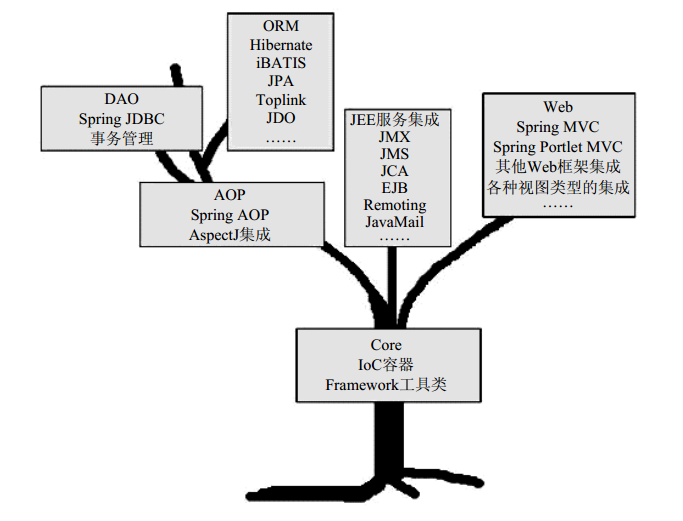
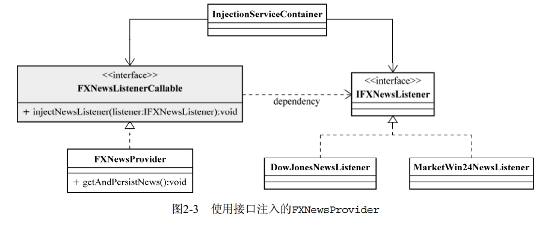

# 第1章 Spring框架的由来

## 1.1 Spring之崛起

## 1.2 Spring框架概述

基于POJO（Plain Old Java Object，简单Java对象）的轻量级开发理念。

Spring总体架构：

## 1.3 Spring大观园

## 1.4 小结

# 第2章 Spring的IOC容器

## 2.1 我们的理念是：让别人为你服务

## 2.2 手语，呼喊，还是心有灵犀

### 2.2.1 构造方法注入

IoC Service Provider会检查被注入对象的构造方法，取得它所需要的依赖对象列表，进而为其注
入相应的对象。同一个对象是不可能被构造两次的，因此，被注入对象的构造乃至其整个生命周期，
应该是由IoC Service Provider来管理的。 

### 2.2.2 setter方法注入

setter方法注入虽不像构造方法注入那样，让对象构造完成后即可使用，但相对来说更宽松一些，
可以在对象构造完成后再注入。 

### 2.2.3 接口注入

对于前两种注入方式来说，接口注入没有那么简单明了。被注入对象如果想要IoC Service
Provider为其注入依赖对象，就必须实现某个接口。这个接口提供一个方法，用来为其注入依赖对象。
IoC Service Provider最终通过这些接口来了解应该为被注入对象注入什么依赖对象。 

示例：

### 2.2.4 三种注入方式的比较

- **接口注入**。不提倡，带有侵入性
- **构造方法注入**。这种注入方式的优点就是，对象在构造完成之后，即已进入就绪状态，可以马上使用。缺点就是，当依赖对象比较多的时候，构造方法的参数列表会比较长。而通过反射构造对象的时候，对相同类型的参数的处理会比较困难，维护和使用上也比较麻烦。而且在Java中，构造方法无法被继承，无法设置默认值。对于非必须的依赖处理，可能需要引入多个构造方法，而参数数量的变动可能造成维护上的不便。 
- **setter方法注入**。因为方法可以命名， 所以setter方法注入在描述性上要比构造方法注入好一些。另外， setter方法可以被继承，允许设置默认值，而且有良好的IDE支持。缺点当然就是对象无法在构造完成后马上进入就绪状态。 

## 2.3 IOC的附加值

