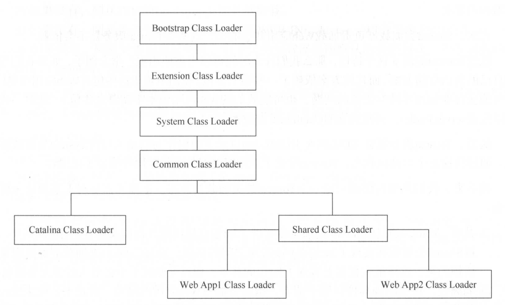
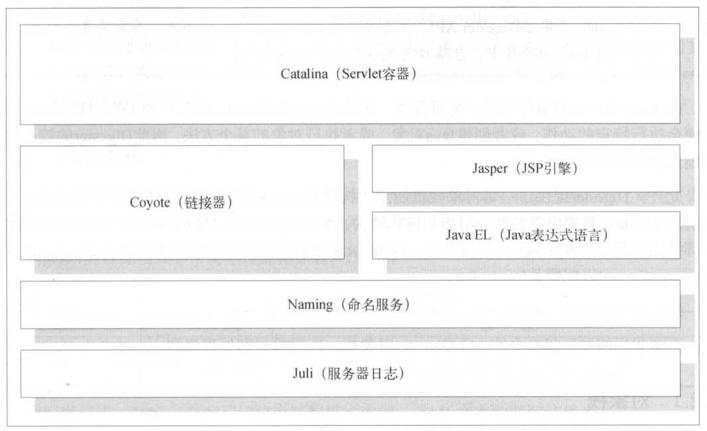
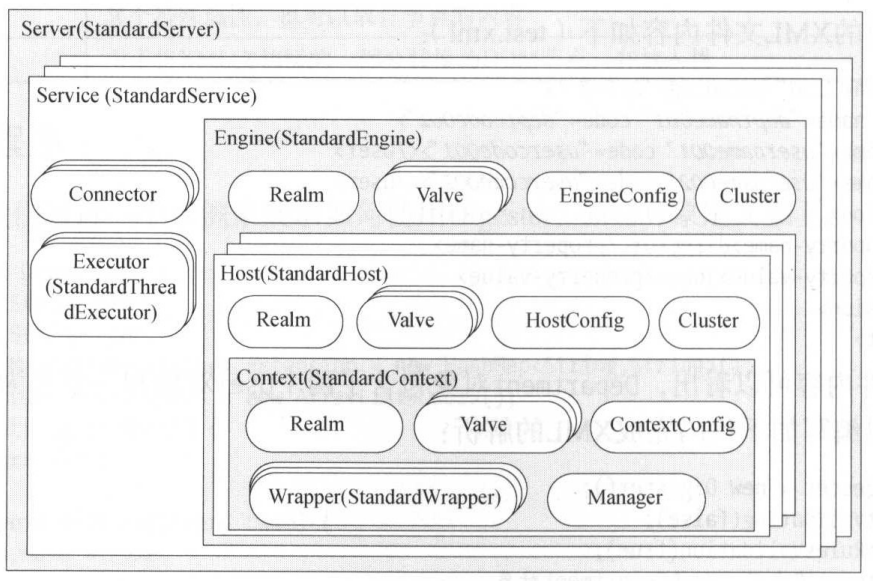

# 第2章 Tomcat总体架构

系统设计及中间件设计时的参考：生命周期管理、可扩展的容器组件设计、类加载方式。

## 2.1 总体设计

如何设计一个应用服务器？

### 2.1.1 Server

最基本的功能：接收请求，业务处理，返回响应。

两个方法：

- start()：启动服务器，打开Socket链接，监听端口，负责接收请求，处理及返回。
- stop()：停止服务器并释放网络资源。

作为嵌入在应用系统中的远程请求处理方案，且访问量低时可行。但作为应用服务器不可行。

### 2.1.2 Connector和Container

请求监听与请求处理放到一起扩展性差。

Connector负责监听，返回。

Container负责处理请求。

均分别拥有自己的start()和stop()方法来加载和释放自己维护的资源。

明显的缺陷：如何让Connector与Container对应？可以维护一个复杂关系映射，但是并不必需。Container设计足够灵活。

引入Service，负责维护多个Connector和一个Container。

在Tomcat中，Container是一个更加通用的概念。为了与Tomcat中的组件命名一致，所以重新命名为Engine，用以表示整个Servlet引擎。

Engine表示整个Servlet引擎。Server表示整个Servlet容器。

### 2.1.3 Container设计

应用服务器是用来部署并运行Web应用的，是一个运行环境，而不是独立的业务处理系统。因此需要在Engine容器中支持管理Web应用，当接收到Connector的处理请求时，Engine容器能够找到一个合适的Web应用来处理。

使用一个Context来表示一个Web应用，并且一个Engine可以包含多个Context。

虚拟主机，加入Host。一个Host可以包含多个Context。

Tomcat的设计中Engine可以包含Host也可以包含Context，这是由具体的Engine实现确定的。Tomcat提供的默认实现StandardEngine只能包含Host。

一个Web应用可以包含多个Servlet实例。在Tomcat中，Servlet定义被称为Wrapper。

“容器”的作用都是处理请求并返回响应数据。所以引入一个Container接口：addchild()添加子容器，backgroundProcess()实现文件变更的扫描。

### 2.1.4 Lifecycle

所有组件均存在启动、停止这两个生命周期方法，可在此基础上扩展生命周期管理的方法，即对于生命周期管理进行一次接口抽象。

将Server接口替换为Lifecycle接口：

- Init()：初始化组件
- start()：启动组件
- stop()：停止组件
- destory()：销毁组件
- addLifecycleListener：添加事件监听器（用于监听组件的状态变化）
- removeLifecycleListener：删除

Tomcat核心组件的默认实现均继承自LifecycleBeanBase抽象类，该类不但负责组件各个状态的转换和事件处理，还将组件自身注册为MBean，以便通过Tomcat的管理工具进行动态维护。

### 2.1.5 Pipeline和Valve

以上设计以保证核心架构的了可伸缩性和可扩展性。但是还要考虑各个组件的灵活性，使其同样可扩展。

责任链模式是一种比较好的选择。Tomcat即采用该模式来实现客户端请求的处理。在Tomcat中每个Container组件通过执行一个责任链来完成具体的请求处理。

Pipeline（管道）用于构造责任链，Valve（阀）代表责任链上的每个处理器。Pipeline中维护了一个基础的Valve（位于末端，最后执行）。

Tomcat的每个层级的容器（Engine、Host、Context、Wrapper）均有对应的基础Valve实现，同时维护一个Pipeline实例。即任何层级的容器都可以对请求处理进行可扩展。

### 2.1.6 Connector设计

基本功能：

- 监听服务器端口，读取来自客户端的请求。
- 将请求数据按照指定协议进行解析。
- 根据请求地址匹配正确的容器进行处理。
- 将响应返回客户端。

Tomcat支持多协议，默认支持HTTP和AJP。同时支持多种I/O方式，包括BIO（8.5之后移除）、NIO、APR。而且在Tomcat8之后新增了对NIO2和HTTP/2协议的支持。因此对协议和I/O进行抽象和建模时需要关注的重点。

在Tomcat中，ProtocolHandler表示一个协议处理器，其包含一个Endpoint（无此接口，仅有AbstractEndpoint抽象类）用于启动Socket监听，还包含一个Processor用于按照指定协议读取数据，并将请求交由容器处理。

在Connector启动时，Endpoint会启动线程来监听，并在接收到请求后调用Processor进行数据读取。

当Processor读取客户端请求后，需要按照请求地址映射到具体的容器进行处理，这个过程即为请求映射。由于Tomcat各个组件采用通用的生命周期管理，而且可以通过管理工具进行状态变更，因此请求映射除考虑映射规则的实现外，还要考虑容器组件的注册与销毁。

Tomcat通过Mapper和MapperListener两个类实现上述功能。前者用于维护容器映射信息，同时按照映射规则（Servlet规范）查找容器。后者实现了ContainerListener和LifecycleListener，用于在容器组件状态发生变更时，注册或者取消对应的容器映射信息。为了实现上述功能，MapperListener实现了Lifecycle接口，当其启动时（在Service启动时启动），会自动作为监听器注册到各个容器组件上，同时将已创建的容器注册到Mapper。

Tomcat通过适配器模式（Adapter）实现了Connector与Mapper、Container的解耦。实现自己的Adapter可以脱离Servlet容器又使用Tomcat链接器。

### 2.1.7 Excutor

并发问题的解决方案。采用线程池（默认采用JDK5的线程池，继承自Lifecycle，当作通用组件进行管理）对线程进行统一管理。

在Tomcat中Excutor由Service维护，因此同一个Service中的组件可以共享一个线程池。

如果没有定义任何线程池，相关组件（Endpoint）会自动创建线程池，此时线程池不再共享。

在Tomcat中，Endpoint会启动一组线程来监听Socket端口，当接收到客户端请求后，会创建请求处理对象，并交由线程池处理，由此支持并发处理客户端请求。

### 2.1.8 Bootstrap和Catalina

除开前面的核心组件外，还需要提供一套配置环境来支持系统的可配置性，便于通过修改配置来优化应用。

集群、安全等组件同样重要，但不属于通用概念。

Tomcat通过类Catalina提供了一个Shell程序，用于解析server.xml创建各种组件，同时，负责启动、停止应用服务器（只需要启动Tomcat顶层组件Server）。

Tomcat使用Digester解析XML文件，包括server.xml以及web.xml等。

最后，Tomcat提供了Bootstrap作为应用服务器启动入口。Bootstrap负责创建Catalina实例，根据执行参数调用Catalina相关方法完成针对应用服务器的操作（启动、停止）。

Bootstrap与Tomcat应用服务器完全松耦合（通过反射调用Catalina实例），它可以直接依赖JRE运行并为Tomcat应用服务器创建共享类加载器，用于构造Catalina实例以及整个Tomcat服务器。

上述是Tomcat标准的启动方式。但是Server及其子组件代表了应用服务器本身，那么我们可以不通过Bootstrap和Catalina来启动服务器。

Tomcat组件说明：

| 组件名称  | 说明                                                         |
| --------- | ------------------------------------------------------------ |
| Server    | 表示整个Servlet容器，因此Tomcat运行环境中只有唯一一个Server实例 |
| Service   | Service表示一个或者多个Connector的集合，这些Connector共享同一个Container来处理其请求。在同一个Tomcat实例内可以包含任意多个Service实例，它们彼此独立 |
| Connector | 即Tomcat链接器，用于监听并转化Socket请求，同时将读取的Socket请求交由Container处理，支持不同协议以及不同的I/O方式 |
| Container | Container表示能够执行客户端请求并返回响应的一类对象。在Tomcat中存在不同级别的容器：Engine、Host、Context、Warpper |
| Engine    | Engine表示整个Servlet引擎。在Tomcat中，Engine为最高层级的容器对象。尽管Engine不是直接处理请求的容器，确实获取目标容器的入口 |
| Host      | Hostz作为一类容器，表示Servlet容器中的虚拟机，与一个服务器的网络名有关，如域名等。客户端可以使用这个网络名连接服务器，这个名称必须在DNS服务器上注册。 |
| Context   | Context作为一类容器，用于表示ServletContext，在Servlet规范中，一个ServletContext即表示一个独立的Web应用 |
| Wrapper   | Wrapper作为一类容器，用于表示Web应用中动议的Servlet          |
| Executor  | 表示Tomcat组件可以共享的线程池                               |

## 2.2  Tomcat启动

Tomcat默认实现在相关概念的基础上结合生命周期管理监听器完成了大量的启动工作。

Tomcat的启动流程非常标准化，统一按照生命周期管理接口Lifecycle的定义进行启动。首先调用init()方法进行组件的逐级初始化，然后再调用start()方法进行启动。

每次调用均伴随着生命周期状态变更事件的触发。

## 2.3 请求处理

 从本质上讲，应用服务器的请求处理开始于监听的Socket端口接收到数据，结束与讲服务器处理结果写入Socket输入流。

## 2.4 类加载器

### 2.4.1 J2SE标准了类加载器

- Bootstrap
- Ext
- System

应用程序在不自己构造类加载器的情况下，使用System作为默认的类加载器。如果构造也是以System作为父类加载器。

JVM还提供了Ensdorsed Standerds Override Mechanism机制用于允许替换JCP之外生成的API。应用程序可以提供新版本的API来覆盖JVM的实现。

### 2.4.2 Tomcat加载器

应用服务器通常会自行创建类加载器以实现更灵活的控制，这一方面是对规范的实现（Servlet规范要求每个Web应用都有一个独立的类加载器实例），另一方面也有架构层面的考虑。

- 隔离性：Web应用库相互隔离，避免依赖库或者应用包相互影响。
- 灵活性：类加载器相互独立可以实现只对容器中的某一个Web应用进行重新部署。
- 性能：搜索Jar包的范围小，性能高。

除了每个Web应用的类加载器外，Tomcat也提供了3个基础的类加载器和Web应用类加载器，而且这3个类加载器指向的路径和包列表均可由catalina.properties配置。

- Common：以System为父类加载器，Tomcat中最顶层的公关类加载器。路径为common.loader，默认指向$CATALINA_HOME$/lib下的包。
- Catalina：以Common为父类加载器，用于加载Tomcat应用服务器的类加载器。路径为server.loader，默认为空（此时Tomcat使用Common类加载器加载应用服务器）。
- Shared：以Common为父类加载器，是所有Web应用的父类加载器。路径为shared.loader，默认为空（此时Tomcat使用Common类加载器加载应用服务器）。
- Web应用：以Shared为父类加载器，加载/WEB-INF/classes目录下的未压缩的Class和资源文件以及/WEB-INF/lib目录下的jar包。该类加载器只对当前Web应用可见，对其他Web应用不可见。

默认情况下三个类加载器为同一个（Common），但可以通过配置创建三个不同的类加载器。

Common类加载器负责加载Tomcat应用服务器内部和Web应用均可见的类，例如Servlet规范和一些通用的包。

Catalina类加载器负责加载只有Tomcat应用服务器内部可见的类，这些类对Web应用不可见。如Tomcat的具体实现类，因为我们的Web应用最好与服务器松耦合，故不应该以来应用服务器的内部类。

Shared类加载器服负责加载Web应用共享的类，这些类Tomcat服务器不会依赖。

举个使用这个特性的例子：分布式Session。需要用到第三方包时，但是我们不希望这些包对Web应用可见（可能存在包版本冲突之类的问题，也可能根本不需要这些包）。此时我们可以配置server.loader，创建独立的Catalina类加载器。

$CATALINA_HOME/bin$目录下的包作为启动入口由System类加载器加载。简化了应用服务器的启动，同时增加了灵活性。

从架构层面分析Tomcat的类加载器方案（补充）：

- 共享。通过分层实现了Jar包在各个层面及子层面的共享，同时确保了不会引入太多的包。
- 隔离性。区别于前者，这服务器与Web应用的隔离。理论上，出去Servlet规范定义的接口外，Web应用不应该依赖服务器的任何实现类（有利于Web应用的可移植性）。正因如此Tomcat支持通过Catalina类加载器加载服务器依赖的包，以便应用服务器与Web应用更好地隔离。

默认情况下Tomcat通过**JVM安全策略许可**，实现在同一个类加载器下，禁止Web应用使用服务器的相关实现类的。

### 2.4.3 Web应用类加载器

双亲委派过程：

1. 从缓存中加载
2. 如果缓存中没有，则从父类加载器中加载
3. 如果父类加载器没有，则从当前类加载器加载
4. 如果没有则抛出异常

Tomcat的委派模型与此的不同之处：当进行类加载时，除JVM基础的类库外，它会首先尝试通过当前类加载器加载，然后在进行委派。

所以Web应用类加载器默认加载顺序如下：

1. 从缓存中加载
2. 若无，JVM的Bootstrap类加载器加载
3. 若无，则从当前类加载器加载（按照WEB-INF/classes、WEB-INF/lib的顺序）
4. 若无，从父类加载器加载（双亲委派），加载顺序为System、Common、Shared。

Tomcat提供了delegate属性用于控制是否启用Java委派，默认false（不启用）。当配置为true时，Tomcat将使用Java默认的委派模式，则将上述3与4交换顺序。

Tomcat还可以通过packageTriggersDeny属性只让某些包路径采用Java的委派模式，Web应用类加载器对于符合packageTriggersDeny指定包路径的类强制采用Java的委派模式。

## 2.5 小结

# 第3章 Catalina

## 3.1 什么是Catalina

Catalina包含了前面讲到的所有容器组件，以及后续章节将会涉及的安全、会话、集群、部署、管理等Servlet容器架构的各个方面。它通过松耦合的方式集成Coyote，以及完成按照请求协议进行数据读写。同时，它还包括启动入口、Shell程序。

## 3.2 Digester

Catalina使用Digester解析XML（server.xml）配置文件并创建应用服务器。

Tomcat在Catalina的创建过程中通过Digester结合LifecycleListener做了大量的初始化工作。

Digester及SAX的事件驱动，简而言之，就是通过流读取XML文件，当识别出特定XML节点后便会执行特定的动作，或者创建Java对象，或者执行对象的某个方法。因此Digester的核心是匹配模式和处理规则。

对象栈机制用于构造Java对象。Digester是非线程安全的。

### 3.2.1 对象栈

Digester的对象栈主要在匹配模式满足时，由处理规则进行操作。

Digester的设计模式是指，在文件读取过程中，如果遇到一个XML节点的开始部分，则会出发处理规则事件创建Java对象，并将其放入栈。当处理该节点的子节点时，该对象都将维护在栈中。当遇到该节点的结束部分时，该对象将会从栈中取出并清除。

需要解决的问题：

- 如何在创建的对象之间建立关联？最终得到的结果应该是一个Java对象树。Digester提供了一个处理规则实现（SetNextRule），该规则会调用位于栈顶部对象之后对象（即父对象）得某个方法，同时将顶部对象（子对象）作为参数传入。通过此种方式不管是一对一还是一对多得关系都可创建。
- 如何持有创建的首个对象，即XML得传入结果？Digester对于曾经放入栈中的第一个对象将会持有一个引用，同时作为parse()方法得返回值。还有一个方式（哨兵）。Tomcat采用哨兵的方式实现。

### 3.2.2 匹配模式

在需要确定当读取到某个约定的XML节点时需要执行何种操作，Digester通过匹配模式指定相关约定。

匹配类似于简单的正则，还可以使用“*”进行模糊匹配。

当匹配模式指定多个处理规则，或者多个匹配规则匹配同一个节点时，均会出现一个节点执行多个处理规则的情况。此时，Digester的处理方式：开始读取节点时按照注册顺序执行处理规则，而完成读取时按照反向顺序执行，即先进后出的规则。

### 3.2.4 处理规则

处理规则需要实现接口org.apache.commoms.digester.Rule，该接口定义了模式匹配时触发的事件方法。

### 3.2.4 示例程序

由于Digester已经提供了常见处理规则的工厂方法，因此，直接嗲用相关方法即可。整个处理过程都不需要手动为何对象输行和对象间关系，不需要解析XML Dom。

## 3.3 创建Server

### 3.3.1 Server的解析

从此处开始涉及到源码。已搭建好源码阅读环境，粗略看了一下内容过多，暂不深入。