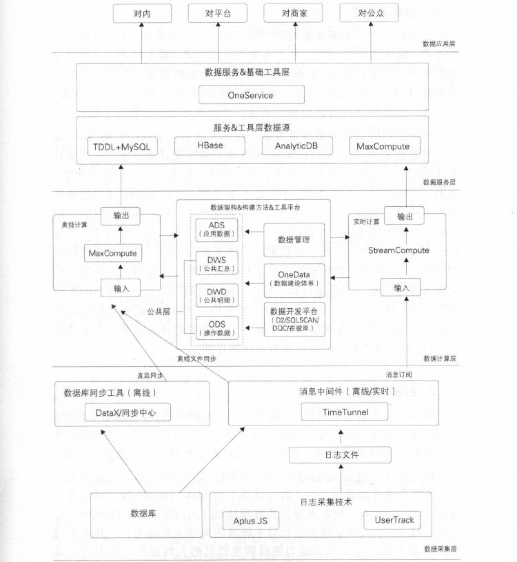
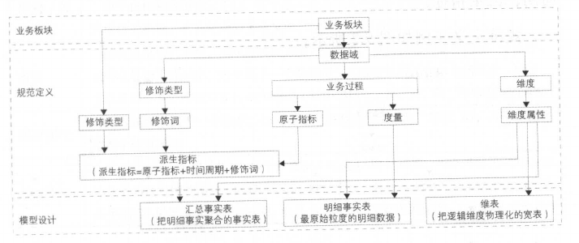
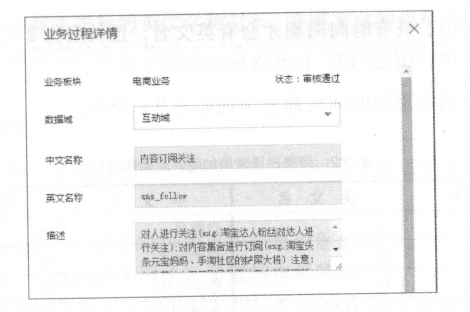
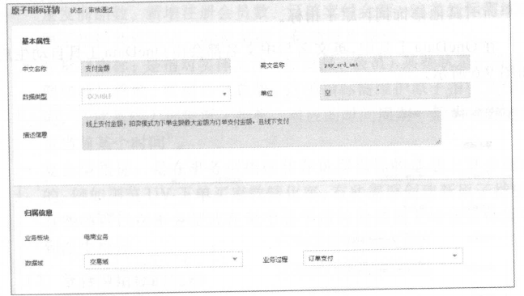
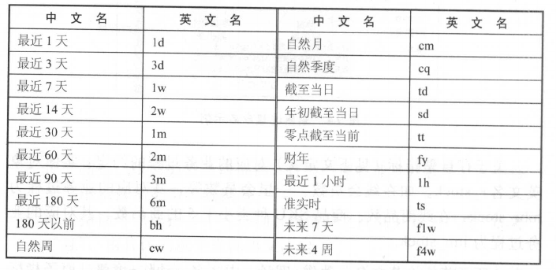
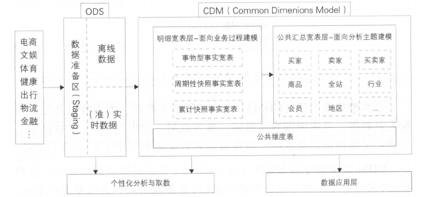
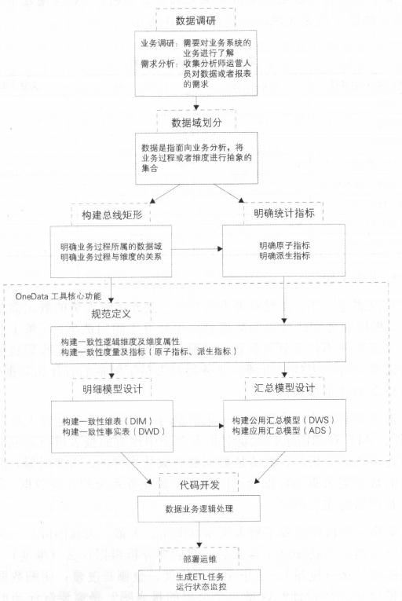
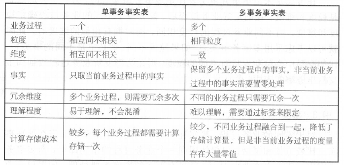

# 序

大、快、多样性只是表象，大数据的真正价值在于生命性和生态性。（活数据）

## 第1 章 总述

如果不能对数据进行有序、有结构地分类组织和存储，如果不能有效利用并发掘它，继而产生价值，那么它同时也成为一场“灾难”。无需、无结构的数据犹如堆积如山的垃圾，给企业带来的是有令人咋舌的高额成本。

要求：

- 如何建设高效的数据模型和体系，是数据易用，避免重复建设和数据不一致性；
- 如何提供高效易用的数据开发工具；
- 如何做好数据质量保障；
- 如何有效管理和控制日益增长的存储和计算消耗；
- 如何保证数据服务的稳定，保证其性能；
- 如何设计有效的数据产品高效赋能于外部客户和内部员工

1. 数据采集层

日志采集体系方案包括两大体系：Aplus.JS是Web端日志采集技术方案；UserTrack是App端日记采集技术方案。

在采集技术基础上面向各个场景的埋点规范。

在传输方面采用TimeTunel（TT）,它既包括数据库的增量数据传输，也包括日志数据的传输；既支持实时流式计算，也知乎此各种时间窗口的批量计算。

也通过数据同步工具（DataX和同步中心，其中同步中心是给予DataX易用性封装的）直连异构数据库（备库）来抽取各种时间窗口的数据。

2. 数据计算层

数据只有被整合和计算,才能被用于洞察商业规律,挖掘潜在信息，从而实现大数据价值,达到赋能于商业和创造价值的目的。

阿里巴巴的数据计算层包括两大体系:数据存储及计算云平台（离线计算平台MaxCompute和实时计算平台StreamCompute）和数据整合及管理体系（内部称之为“ OneData ”） 。

- MaxCompute是阿里巴巴自主研发的离线大数据平台。

- StreamCompute是阿里巴巴自主研发的流式大数据平台。

- OneData是数据整合及管理的方法体系和工具。

借助此体系，构建了数据公共层。

从数据计算频率角度来看，阿里数据仓库可以分为离线数据仓库（传统的数据仓库概念）和实时数据仓库（典型应用：双11实时数据）。

阿里数据仓库的数据加工链路也是遵循业界的分层理念，包括：

- 操作数据层（Operational Data Store，ODS）;
- 明细数据层（Data WareHouse Detail，DWD）；
- 应用数据层（Application Data Store，ADS）。

通过数据仓库不同层次之间的加工过程实现从数据资产向信息资产的转化，并且对整个过程进行有效的元数据管理及数据质量处理。

元数据模型整合及应用是一个重要的组成部分，主要包含：

- 数据源元数据
- 数据仓库元数据
- 数据链路元数据
- 工具类元数据
- 数据质量类元数据

元数据应用主要面向数据发现、数据管理等，如用于存储、计算和成本管理。

3. 数据服务层

当数据已被整合和计算好之后，需要提供给产品和应用进行数据消费。

针对不同的需求，数据服务层的数据源架构在多种数据库之上，如Mysql和HBase。

数据服务层主要考虑性能、稳定性、扩展性。

OneService（数据服务平台）一数据仓库整合计算好的数据作为数据源，对外通过接口的方式提供数据服务，主要提供简单数据查询服务、复杂数据查询服务（用户识别、用户画像等）和实时数据推送服务。

4. 数据应用层

# 第1篇 数据技术篇

## 第2章 日志采集

# 第2篇 数据模型篇

## 第8章 大数据领域建模综述

### 8.1 为什么需要数据建模

如何将数据进行有序、有结构地分类组织和存储？

数据模型就是数据组织和存储方法，它强调从业务、数据存取和使用角度合理存储数据。有了适合业务和基础数据存储环境的模型，那么大数据就能获得以下好处：

- 性能：良好的数据模型能帮助我们快速查询所需要的数据，减少数据的I/O吞吐。
- 成本：良好的数据模型能极大地减少不必要的数据冗余，也能实现计算结果复用，极大地降低大数据系统中的存储和计算成本。
- 效率：良好的数据模型能极大地改善用户使用数据的体验，提高使用数据的效率。
- 质量：良好的数据模型能改善数据统计口径的不一致性，减少数据计算错误的可能性。

### 8.2 关系行数据库系统和数据仓库

大数据领域仍然使用关系型数据库，使用关系理论描述数据之间的关系，只是基于其数据存储的特点关系数据模型的范式上有了不同的选择。

### 8.3 从OLTP和OLAP系统特别看模型方法论的选择

OLTP系统通常面向的主要数据操作是随即读写，主要采用满足3NF的实体关系模型存储数据，从而在事务处理中解决数据的冗余和一致性问题；而OLAP系统面向的主要数据操作时批量读写，事物处理中的一致性不是OLAP所关注的，其主要关注数据的集合，以及在一次性的复杂大数据查询和处理中的性能，因此它需要采用一些不同的数据建模方法。

### 8.4 典型的数据仓库建模方法论

#### 8.4.1 ER模型

数据仓库中的3NF和OLPT系统中的3NF的却别在于，它是站在企业角度面向主题的抽象，而不是针对某个具体业务流程的实体对象关系的抽象。其具有以下几个特点：

- 需要全面了解企业业务和数据；
- 事实周期非常长；
- 对建模人员的能力要求非常高。

采用ER模型建设数据仓库魔性的出发点是整合数据将个系统中的数据以整个企业角度按主题进项相似性组合和合并，并进行一致性处理，为数据分析决策服务，但是并不能直接用于分析决策。

其建模步骤分为三个阶段：

- 高层模型：一个高度抽象的模型，描述主要的主题以及主题间的关系，用语描述企业的业务总体概况。
- 中层模型：在高层模型的基础上，细化主题的数据项。
- 物理模型（也叫底层模型）：在中层模型的基础上，考虑物理存储，同时基于性能和平台特点进行物理属性的设计，也可能作一些表的合并、分区的设计等。

实践典型：金融业务FS-LDM。

#### 8.4.2 维度模型

是数据仓库工程领域最流行的数据仓库建模的经典。

维度建模从分析决策的需求出发构建模型，为分析需求服务，因此它重点关注用户如何更快速地完成需求分析，同时具有较好的大规模复杂查询的响应性能。其典型的代表是星形模型，以及在一些特殊场景下使用的雪花模型。其设计分为一下几个步骤：

- 选择需要进行分析决策的业务过程。业务过程可以是单个业务事件，比如交易的支付、退款等；也可以时某个时间的状态，比如当前的账户余额等；还可以是一系列相关业务时间组成的业务流程，具体需要看我们分析的是某些事件发生情况，还是当前状态，或是事件流转效率；
- 选择粒度。在事件分析中，我们要预判所有分析需要细分的程度，从而决定选择的粒度。粒度是维度的一个组合；
- 识别维表。选择好粒度之后，就需要细雨此粒度设计维表，包括维度属性，用于分析时进行分组和筛选；
- 选择事实。确定分析需要衡量的指标。

#### 8.4.3 Data Vault模型

ER模型的衍生。其设计的出发点也是为了实现数据的整合，但不能直接用于数据分析决策。

#### 8.4.4 Anchor模型

对Data Vault模型做了进一步规范化处理。

### 8.5 阿里巴巴数据模型实践综述

第一个阶段：完全应用驱动的时代，构建在Oracle上，数据完全一满足报表需求为目的，将数据以与源结构相同的方式同步不到Oracle（ODS层），数据工程师基于ODS数据进行统计，基本没有系统化的模型方法体系，完全基于对Oracle数据库特性的利用进行数据存储和加工，部分采用一些维度建模的缓慢变化维方式进行历史数据处理。这时候的数据架构只有两层，即ODS+DSS。

第二个阶段：随着业务发展，数据量增加，性能成为一个较大的问题，因此引入了当时MPP架构体系的Greenplum，同时进行数据架构优化希望通过模型技术改变开发模型，消除一些冗余，提升数据的一致性。开始尝试将工程领域比较流行的ER模型+维度模型方式，构建出一个四成的模型架构，即ODL（数据操作层）+BDL（基础数据层）+IDL（接口数据层）+ADL（应用数据层）。ODL和源系统保持一致；BDL希望以引入ER模型，加强市局的整合，构建一致的基础数据模型；IDL基于维度模型方法构建集市层；ADL完成应用的个性化和基于展现需求的数据组装。遇到的困难与挑战：构建ER模型（业务发展迅速，人员快速变化、业务知识功底的不够全面）。

在不太成熟、快速变化的业务面前，构建ER模型的风险非常大，不太适合去构建ER模型。

第三个阶段：业务继续发展，Hadoop为代表的分布式存储计算平台也在快速发展，阿里巴巴自主研发的分布式计算平台MaxCompute。选择了以Kimball的维度建模为核心理念的模型方法论，同时对其进行了一定的升级和扩展，构建了阿里巴巴集团的公共层模型数据架构体系。

数据公共层建设的目的是着力解决数据存储和计算的共享问题。

阿里巴巴数据公共层建设的指导方法是一套同意话的集团数据整合及管理的方法体系（内部成为OneData），其包括一致性的指标定义体系、模型设计方法体系及配套工具。

## 第9章 阿里巴巴数据整合及管理体系

面对爆炸式增长的数据，如何建设高效的数据模型和体系，对这些数据进行有序和有结构地分类组织和存储，避免重复建设和数据不一致性，保证数据的规范性，一直时大数据系统建设不断追求的方向。

### 9.1 概述

从业务架构设计到模型设计，从数据研发到数据服务，做到数据可管理、可追溯、可规避重复建设。

#### 9.1.1 定位及价值

建设统一的、规范化的数据介入层（ODS）和数据中间层（DWD和DWS），通过数据服务和数据产品，完成服务于阿里巴巴的数据系统建设，即数据公共层建设。提供标准化的（Standard）、共享的（Shared）、数据服务（Service）能力，将数据互通成本，释放计算、存储、人力等资源，以消除业务和技术之痛。

#### 9.1.2 体系架构

业务板块：由于阿里巴巴集团业务生态庞大、所以根据业务的属性划分出几个相对独立的业务板块，业务板块之间的指标或业务重叠性较小，如点上业务板块涵盖淘系、B2B系和AliExpress系等。

规范定义：阿里数据业务庞大，结合行业的数据仓库建设经验和阿里数据自身特点，设计出的一套数据规范命名体系，规范定义将会被用在模型设计中。

模型设计：以维度建模理论为基础，给予维度建模总线架构，构建一致性的维度和事实（进行规范定义）。同时，在落地标模型时，给予阿里自身业务特点，设计出一套表规范命名体系。

### 9.2 规范定义

规范定义指以维度建模作为理论基础，构建总线矩阵，划分和定义数据域、业务过程、维度、度量/原子指标、修饰类型、修饰词、时间周期、派生指标。

#### 9.2.1 名词术语

| 名词术语      | 解释                                                         |
| ------------- | :----------------------------------------------------------- |
| 数据域        | 指面向业务分析，将业务过程或者维度进行抽象的集合。其中，业务过程可以概括为一个个不可拆分的行为事件，在业务过程之下，可以定义指标；维度是指度量的环境，如买家下单时间，买家是维度。为保障整个体系的生命力，数据域是需要抽象提炼的，并且长期维护和更新的，但不轻易变动。在划分数据域时，既能涵盖当前所有的业务需求，又能在新业务进入时无影响地被包含进已有的数据域中和扩展新的数据域。 |
| 业务过程      | 指企业的业务活动事件，如下单、支付、退款都是业务过程。请注意，业务过程是一个不可拆分的行为事件，通俗地讲，业务过程就是企业活动中的事件。 |
| 时间周期      | 用来明确数据统计的时间范围或者时间点，如最近30天、自然周、截至当日等。 |
| 修饰类型      | 是对修饰词的一种抽象划分。修饰类型从术语某个业务域，如日志域的访问终端类型涵盖无线端、PC端等修饰词 |
| 修饰词        | 指除了统计维度以外指标的业务场景限定抽象。修饰词隶属于一种修饰类型，如在日志域的访问终端类型下，有修饰词PC端、无线端等 |
| 度量/原子指标 | 原子指标和度量含义相同，基于某一业务事件行为下的度量，是业务定义中不可再拆分的指标，具有明确业务含义的名词，如支付金额 |
| 维度          | 维度是度量的环境，用来反映业务的一类属性，这类属性的集合构成一个维度，也可称之为实体对象。维度属于一个数据域，如地理纬度（其中包括国家、地区、省以及城市等级别的内容）、时间维度（其中包括年、季、月、周、日等级别的内容） |
| 维度属性      | 维度属性隶属于一个维度，如地理维度里面的国家名称、国家ID、省份名称等都属于维度属性 |
| 派生指标      | 派生指标=一个原子指标+多个修饰词（可选）+时间周期。可以理解为对原子指标业务统计范围的圈定。如原子指标：支付金额，最近1天海外买家支付金额则为派生指标（最近1天为时间周期，海外为修饰词，买家作为维度，而不作为修饰词） |

#### 9.2.2 指标体系

本文在讲述指标时，会涵盖其组成体系（原子指标、派生指标、修饰类型、修饰词、时间周期），将它们作为一个整体来解读。

1. 基本原则

   （1）组成体系之间的关系

   - 派生指标有原子指标、时间周期修饰词、若干其他修饰词组合得到
   - 原子指标、修饰类型及修饰词，直接归属在业务过程下，其中修饰词继承修饰类型的数据域。
   - 派生指标可以选择多个修饰词，修饰词之间的关系为“或”或者“且”，有具体的派生指标语义定义决定
   - 派生指标唯一归属一个原子指标，继承原子指标的数据域，与修饰词的数据域无关。

	一般而言，事务型指标和存量型指标智慧为一定味道一个业务过程，如果遇到同时有两个行为发生、需要多个修饰词、生成一个派生指标的情况，则选择时间靠后的行为创建原子指标，选择时间靠前的行为创建修饰词。
	
	- 原子指标有确定的英文字段名、数据类型和算法说明；派生指标要继承原子指标的英文名，数据类型和算法要求。
	
	（2） 命名约定
	
	- 命名所用术语。指标命名，尽量使用英文简写，其次是英文，当指标英文名太长时，可考虑用汉语拼音首字母命名。如中国制造，用zgzc。在OneData工具中维护着常用的名词属于，以用来进行命名。
	- 业务过程。英文名：用英文或英文的缩写或者中文拼音简写；中文名：具体的业务过程中文即可。
	
	关于存量型指标对应的业务过程的约定：实体对象英文名+_stock。如在线会员数、一星会员数等，其对应的业务过程为mbr_stock；在线商品数、商品SKU种类小于5的商品书，其对应的业务过程为itm+stock。
	
	- 原子指标。英文名：动作+度量；中文名：动作+度量。原子指标必须挂靠在某个业务过程下。
	- 修饰词。只有时间周期才会有英文名，且长度为2位，加上“_”位3位，例如\_1d。其他修饰词无英文名。
	- 派生指标。英文名+原子指标英文名+时间周期修饰词（3位）+序号（4位，例如_001）；中文名：时间周期修饰词+[其他修饰词]+原子指标。
	
	为了控制派生指标的英文名称过长，在英文名的理解和规范上做了取舍，所有修饰词的含义都含入了序号中。序号是跟觉原子指标+派生指标自增的。
	
	（3）算法
	
	原子指标、修饰词、派生指标的算法说明必须让各种使用人员看得明白，包括：
	
	- 算法该书——算法对应的用户容易理解的阐述。
	- 举例——通过具体例子帮助理解指标算法。
	- SQL算法说明——对于派生指标给出SQL的写法或者伪代码。
	
2. 操作细则

（1）派生指标的种类

分为三类：事物型指标、存量型指标和复合型指标。按照其特性不同，有些必须新建原子指标，有些可以在其他类型原子指标的基础上增加修饰词形成派生指标。

- 事物型指标：指对业务活动进行衡量的指标。（例如新发商品数，重发商品数等）需要维护原子指标及修饰词，在此基础上创建派生指标。
- 存量型指标：只对对实体对象某些状态（商品、会员）的统计。（例如商品总数、注册会员总数），需要维护原子指标及修饰词，再次基础上创建派生指标，对应的时间周期一般位“历史截止至当前某个时间”。
- 复合型指标：是在事物型指标和存量型指标的基础上复合而成的。例如浏览UV-下单买家数转化率，有些需要创建新原子指标，有些则可以在事物型或存量型原子指标的基础上增加修饰词得到派生指标。

（2）复合型指标的规则

- 比率型：创建原子指标。
- 比例型：创建原子指标，如百分比、占比。
- 变化量型：不创建原子指标，增加修饰词，在此基础上创建派生指标。
- 变化率型：创建原子指标。
- 统计型（均值、分位数等）：不创建原子指标，增加修饰词，在此基础上创建派生指标；在修饰类型“统计方法”下增加修饰词，如人均、日均、行业平均、商品平均等。
- 排名型：创建原子指标，一般为top_xxx_xxx或者rank组合，创建派生指标时选择对应的修饰词：
	
	- 统计方法
	- 排名名次
	- 排名范围
	- 根据什么排序
- 对象集合型：主要是指数据产品和应用需要展现数据时，将一些对象那个以k-v对的方式存储在一个字段，方便前端展现。创建原子指标，一般为xx串；创建派生指标时选择对应的修饰词如下：
	
	- 统计方法（如排序、升序）。
	- 排名名次（如TOP10）。
	- 排名范围（如行业、行业）。
	

3. 其他规则

（1）上下层级派生指标同时存在时

如最近1天支付金额和最近1天PC端支付金额，建议使用前者，把PC端作为维度属性存放在物理表中体现。

（2）父子关系原子指标存在时

当父子关系原子指标存在时，派生指标使用原子指标创建派生指标。如PV，IPV（商品详情页PV），当统计商品详情也PV时，优先选择子原子指标。

### 9.3 模型设计

#### 9.3.1 指导理论

遵循维度建模思想。数据模型的维度设计主要以维度建模理论为基础，基于维度数据模型总线架构，构建一致性的维度和事实。

#### 9.3.2 模型层次

三层：数据操作层ODS、公共维度模型层CDM、应用数据层ADS，其中公共维度模型层包括明细数据层DWD和汇总数据层DWS。

操作数据层ODS：把操作系统数据几乎无处理地存放在数据仓库系统中。

- 同步：结构化数据增量或全量同步到MaxCompute。
- 结构化：非结构化（日志）结构化处理并存储到MaxCompute。
- 累积历史、清洗：根据数据业务需求及稽核和审计要求保存历史数据、清洗数据。

公共维度模型层CDM：存放明细事实数据、维表数据及公共指标汇总数据，其中明细事实数据、维表数据一般根据ODS层数据加工生成；公共指标汇总数据一般根据维表数据和明细事实数据加工生成。

CDM层又细分为DWD层和DWS层，采用维度模型方法作为理论基础，更多地采用一些维度退化受大，将唯独退化至事实表中，减少事实表和维表的关联，提高明细数据表的易用性；同时在汇总数据层，加强指标的维度退化，采用更多的宽表化手段构建公共指标数据层，提升公共指标的复用性，减少重复加工。其主要功能如下：

- 组合相关和相似数据：采用明细宽表，复用关联计算，减少数据扫描。
- 公共指标统一加工：基于OneData体系构建命名规范、口径一致和算法统一的统计指标，为上层数据产品、应用和服务提供公共指标；建立逻辑汇总宽表。
- 建立一致性维度：建立一致的数据分析维表，降低数据计算口径、算法不统一的风险。

应用数据层ADS：存放数据产品个性化的统计指标数据，根据CDM层和ODS层加工生成。

- 个性化指标加工：不公用性、复杂性（指数型、比值型、排名型指标）。
- 基于应用的数据组装：大宽表集市、横表转纵表、趋势指标串。

数据调用服务优先使用公共维度模型层（CDM）数据，当公共层没有数据时，需评估是否需要创建公共层数据，当不需要建设公用的公共层时，方可直接使用操作数据层ODS数据。应用数据层ADS作为产品特有的个性化数据一般部队外提供数据服务，但是ADS作为被服务方也需要遵守这个约定。

#### 9.3.3 基本原则

1. 高内聚低耦合
2. 核心模型和扩展模型分离
3. 公共处理逻辑下沉及单一
4. 成本与性能平衡
5. 数据可回滚
6. 一致性
7. 命名清晰、可理解

### 9.4 模型实施

#### 9.4.1 业界常用的模型实施过程

1. Kimball模型实施过程

（1）高层模型

（2）详细模型

（3）模型审查、再设计和验证

（4）提交ETL设计和开发

2. Inmon模型实施过程

3. 其他模型实践过程

- 业务建模，生成业务模型，主要解决业务层面的分解和程序化。
- 领域建模，生成领域模型，主要是对业务模型进行抽象处理，生成领域概念模型。
- 逻辑建模，生成逻辑模型，主要是将领域模型的概念实体以及实体之间的关系数据库层次的逻辑化。
- 物理建模，生成模型逻辑，主要解决逻辑模型针对不同关系数据库的物理化以及性能等一些具体的技术问题。

#### 9.4.2 OneData实施过程

1. 指导方针

首先，在建设大数据数据仓库时，要进行充分的业务调研和需求分析。

其次，进行数据总体架构设计，主要是跟觉数据域对数据进行划分，按照维度建模理论，构建总线矩阵、抽象出业务过程和维度。

再次，对报表需求进行抽象整理出相关指标体系。

最后，就是代码研发和运维。

2. 实施工作流
 

（1）数据调研

- 业务调研

一般各个业务领域独资建设数据仓库，业务领域内的业务线由于业务相似、业务相关性较大，进行统一集中建设。

- 需求调研

与BI，运营商讨数据诉求（大部分为报表需求）。

对报表系统中现有的报表进行研究分析。

（2）架构设计

- 数据域划分

数据域面向业务分析，将业务过程或者维度进行抽象的集合。

业务过程可以概括为一个个不可拆分的行为事件。

为保障整个体系的生命力，数据域需要抽象提炼，并且长期维护和更新，但不轻易变动。

- 构建总线矩阵

明确每个数据域下有哪些业务过程。

业务过程与哪些维度相关，并定义每个数据域下的业务过程和维度。

（3）规范定义

定义指标体系、修饰词、时间周期和派生指标。

（4）模型设计

包括维度和属性的规范定义，维表、明细事实表和汇总事实表的模型设计。

（5）总结

该实施过程是一个高度迭代和动态的过程，一般采用螺旋式实施方法。在总体架构设计完成之后，开始根据数据域进行迭代式模型设计和评审。在架构设计、规范定义和模型设计等模型实施过程中，都会引入评审机制,以确保模型实施过程的正确性。

## 第10章 维度设计

### 10.1 维度设计基础

#### 10.1.1 维度的基本概念

维度是维度建模的基础和灵魂。再维度建模中，将度量称为“事实”，将环境描述为“维度”，维度是用于分析事实所需要的多样环境。

维度所包含的表示维度的列，称为维度属性。维度属性是查询约束条件、分组和报表标签生成的基本来源，是数据易用性的关键。维度的作用一般是查询约束、分类汇总以及排序等。

获取维度或维度属性：

- 在报表中获取
- 和业务人员的交谈中发现维度或维度属性

维度使用主键标识其唯一性，主见也是确保与之相连的任何事实表之间存在引用完整性的基础。

主键有两种：代理键和自然键。

#### 10.1.2 维度的基本设计方法

维度的设计过程就是确定维度属性的过程。数据仓库的能力直接与维度属性的质量和深度成正比。

淘宝商品的维度设计：

1. 选择维度或新建维度。必须保证维度的唯一性。
2. 确定主维表。此处一般是ODS表，直接与业务系统同步。
3. 确定相关维表。根据对业务的树立，确定哪些表和主维表存在关联关系，并选择其中的某些表用于生成维度属性。

4. 确定维度属性。先从主维表中选择维度属性或生成新的维度属性，然后从相关维表中选择维度属性或生成心的维度属性。

确定维度属性的几点提示：

（1）尽可能生成丰富的维度属性

（2）尽可能多地给出包括一些富有意义的文字性描述。

（3）区分数字型属性和事实。需要参考字段的具体用途。

（4）尽量沉淀出通用的维度属性。

#### 10.1.3 维度的层次机构

维度中的一些描述属性以层次方式或一对多的方式相互关联，可以被理解为包含连续主从关系的属性层次。

层次的最底层代表维度中描述最低级别的详细信息，最高层代表最高级别的概要信息。

在属性的层次结构中进行钻取是数据钻取的方法之一。

#### 10.1.4 规范化和反规范化

当属性层次被实例化为一系列维度，而不是单一的维度时，被称为雪花模式。

维度的属性层次合并到单个维度中的操作称为反规范化。分析系统的主要目的是用于数据分析和统计，如何更方便用户进行统计分析决定了分析系统的优劣。采用雪花模式，用户在统计分析的过程中需要大量的关联操作，使用复杂度高，同时查询性能很差；而采用反规范化处理，则方便、易用且性能好。

采用雪花模式，除了可以节约一部分存储外，对于OLAP系统来说没有其他效用。

#### 10.1.5 一致性维度和交叉探查

迭代式的构建数据仓库存在的问题：单独构建会形成独立性数据即使，导致严重的不一致性。

通过构建企业范围内一致性维度和事实来构建总线架构。

数据仓库总线架构的重要基石之一就是一致性维度。将不同数据域的商品的事实合并在一起进行数据探查，如计算转化率等，成为交叉探查。

如果不同数据域的计算过程使用的维度不一致，就会导致交叉探查存在问题。当存在重复的维度，但维度属性或维度属性的值不一枝时，会导致交叉探查无法进行或交叉探查结果错误。基本可以划分为维度格式和内容不一致两种类型。

维度一致性的几种表现形式：

- 共享维表。
- 一致性上卷，其中一个维度的维度属性是另一个维度的维度属性的子集，且两个维度的公共维度属性结构和内容相同。
- 交叉出行，两个维度具有部分相同的维度属性。

### 10.2 维度设计高级主题

#### 10.2.1 维度整合

数据仓库是一个面向主题的、继承的、非易失的且随时间变化的数据集合，用来支持管理人员的决策。

不同数据来源之前的具体差异：

- 应用在编码、命名习惯、度量单位等方面会存在很大的差异。
- 应用出于性能和扩展性的考虑，或者随技术架构的演变，以及业务的发展，采用不同的屋里实现。

数据集成的具体体现：

- 命名规范的统一。表明、字段名
- 字段类型的统一。相同和相似字段的字段类型统一。
- 公共代码及代码值的统一。
- 业务含义相同的表的统一。高内聚、低耦合，主要有以下几种集成方式：
  - 采用主从表的设计方式，主表放基本信息，从表放从属信息。
  - 直接合并，共有信息和个性信息都放在同一个表中。
  - 不合并，因为源表的表结构及主键等差异很大。

表级别的整合：

1. 垂直整合，即不同的来源表包含相同的数据集，只是存储的信息不同。
2. 水平整合，及不同的来源表包含不同的数据集，不同子集之间无交叉，也可以存在部分交叉。交叉或者超自然键

#### 10.2.2 水平拆分

维度通常可以按照类别或类型进行细分。

设计维度的两种方案：

- 将维度的不同分类实例化为不同的属性，同时在主维度中保存公共属性
- 维护单一维度，包含所有可能的属性

设计维度的三个原则：

- 扩展性。高内聚、低耦合
- 效能。在性能和存储成本方面取得平衡。
- 易用性。可理解度高则易用性低。

对维度进行水平拆分是的两个依据：

- 维度的不同分类的属性差异情况。
- 业务的关联程度。

#### 10.2.3 垂直拆分

维度属性的来源表产出的时间不同。维度属性使用频率不同。有的维度属性经常变化。

基于扩展性、产出时间、易用性等方面的考虑，设计主从维度。主维表存放稳定、产出时间早、热度高的属性。

#### 10.2.4 历史归档

归档策略：

1. 同前台归档策略，在数仓中实现前台归档算法。适用于前台逻辑简单
2. 同前台归档策略，但采用数据库变更日志的方式。不需要关注前台归档策略，简单易行
3. 数仓自定义归档策略。原则是比前台应用晚归档，少归档。

如果技术条件允许，能够解析数据库binlog日志，建议使用归档策略2，规避前台归档算法。

### 10.3 维度变化

#### 10.3.1 缓慢变化维

反映历史变化，如何处理维度变化？

缓慢变化维：维度的属性并不是静态的，会随着时间发生缓慢变化。与数据增长较为快速的事实表相比，维度变化相对缓慢。

处理缓慢变化维的三种方式：

- 重写维度值。不保留历史数据，始终最新
- 插入新的维度行。保留历史数据
- 添加维度列。

#### 10.3.2 快照维度

每天保留一份全量快照数据。

优点：

- 简单而有效，开发和维护成本低。
- 使用方便，理解性好。

弊端：极大的存储浪费。

#### 10.3.3 极限存储

1. 透明化：底层的数据还是历史拉链数据，但是上层做一个试图或者hook，吧对极限存储前的表转换成对极限存储表的查询。

2. 分月做历史拉链表。

极限存储压缩了全量存储的成本，同时对下游用户透明。

局限性：产出效率较低，对于变化频率高的数据并不能达到节约成本的效果。

实际生产中的格外处理：

- 在极限存储前做一个全量存储表，保留最近一段时间的全量分区数据。
- 对于部分变化频率频繁的字段需要过滤。

#### 10.3.4 微型模型

通过将一些属性移到全新的维表中，可以解决维度的过度增长导致极限存储效果大打折扣的问题。通过垂直拆分和微型模型可以实现。

阿里数仓不使用此技术的原因：

- 微型维度的局限性。
- ETL逻辑复杂。
- 破坏了维度的可浏览性。

### 10.4 特殊维度

#### 10.4.1 递归层次

按照层级是否固定分为均衡层次结构和非均衡层次结构。

由于很多数据仓库系统和商业只能工具不支持递归SQL，且递归的成本较高，所以需要对此层次结构进行处理。

1. 层次结构扁平化。（回填，将类目向下虚拟）
2. 层次桥接表。灵活性高但是复杂。

#### 10.4.2 行为维度

种类划分：

- 另一个维度的过去行为。
- 快照事实行为维度。
- 分组事实行为维度。
- 复杂逻辑是时行为维度。

两种处理方式：

- 将其冗余至现有的维度表中。
- 加工成单独的维度表。

两个原则：

- 避免过快增长。
- 避免耦合度过高。

#### 10.4.3 多值维度

三种常见的处理方式：

- 降低事实表的粒度。
- 采用多字段。
- 采用较为通用的桥接表。

#### 10.4.4 多值属性

维表中的某个属性字段同时有多个值成为多值属性。

三种常见的处理方式：

- 保持维度主键不变，将多值属性放在维度的一个属性字段中。（扩展性好，使用麻烦）
- 保持维度主键不变，将多值属性放在维度的多个属性字段中。
- 维度主键发生变化，一个维度值存放多条记录。（扩展性好，使用方便，但是数据急剧膨胀）

#### 10.4.5 杂项维度

是由操作型系统种的指示符或者标志字段组合而成的，一般不再一致性维度之列。

通常的做法是将这些字段建立到一个维表中，在事实表中只保存一个外键。

## 第11章 事实表设计

### 11.1 事实表基础

#### 11.1.1 事实表特性

事实表作为数据仓库维度建模的核心，紧紧围绕业务过程来设计，通过获取描述业务过程的度量来表达业务过程，包含了引用的维度和业务过程有关的度量。

事实表中一条巨禄所表达的业务细节程度被称为粒度。

粒度的两种表述方式：

- 维度属性组合所表示的细节粒度；
- 所表示的具体业务含义。

作为度量业务过程的事实，一般位整形或浮点型的十进制数值，有可加性、半可加性和不可加性三种类型。

可加性是指可以按照与事实表关联的任意维度进行汇总。

半可加性事实只能按照特定维度汇总。

比率型事实完全不具备可加性。对于不可加性事实可分解为可加的组件来实现聚集。

相对维表来说，通常事实表要细长得多，行的增加速度也比维表快很多。

事实表的三种类型：

- 事物事实表：用来描述业务过程，跟踪空间或时间上某点的度量事件，保存的是最原子的数据，也成为原子事实表。
- 周期快照事实表：依据有规律性的、可预见的时间见过记录事实，时间间隔如每天、每月、每年等。
- 累积快照事实表：用来表述过程开始和结束之间的关键步骤事件，覆盖过程的整个生命周期，通常具有多个日期字段来记录关键时间点，当过程随着生命周期不断变化时，记录也会随着过程的变化而被修改。

#### 11.1.2 事实表设计原则

- 尽可能包含所有与业务过程相关的事实
- 之选择与业务过程相关的事实
- 分解不可加性事实为客家的组件
- 在选择维度和事实之前必须先声明粒度
- 在同一个事实表中不能有多种不同力度的事实
- 事实的单位要保持一直
- 对事实的null值要处理
- 使用退化维度提高事实表的易用性

#### 11.1.3 事实表设计方法

Kimball的四步设计：选择业务过程、声明粒度、确定维度、确定事实。

改进后的设计方法：

1. 选择业务过程及确定事实表类型。

2. 声明粒度。粒度意味着精确定义事实表的没一行所表示的业务含义，粒度传递的是与事实表粒度有关的细节层次。明确粒度能确保事实表中行的意思的理解不会产生混淆，保证所有的事实按照同样的细节层次记录。

3. 确定维度。选择能够描述清楚业务过程所处的环境的维度信息。
4. 确定事实。
5. 冗余维度。提高使用侠侣，降低数据获取的复杂性，减少关联的表数量。

### 11.2 事务事实表

#### 11.2.1 设计过程

任何类型的事件都可以被理解为一种事务。

（1）选择业务过程

（2）确定粒度

（3）确定维度

（4）确定事实

（5）冗余维度

#### 11.2.2 单事务事实表

即针对每个业务过程设计一个事实表。可以方便地对每个业务过程进行独立的分析研究。

### 11.2.3 多事务事实表

将不同的事实放到同一个事实表中，即对同一个事实包含不同的业务过程。

进行事实处理的两种方式：

- 不同业务过程的事实使用不同的事实字段进行存放。
- 不同业务过程的事实使用同一个事实字段进行存放，但增加一个业务过程标签。

多事务事实表的选择：

- 当不同业务过程的度量比较相似、差异不大时，可以使用同一个字段来表示度量数据。存在的问题：在同一个周期内会存在多条记录。
- 当不同业务过程的度量差异较大时，可以将不同业务过程度量使用使用不同字段冗余到表中，非当前业务过程则置零表示。存在的问题：度量字段零值较多。

#### 11.2.4 两种事实表对比

1. 业务过程

单事务事实表，一个业务过程建立一个事实表，只反映一个业务过程的事实；

多事务事实表，在同一个事实表中反映过个业务过程。

需要相似性和业务源系统，选择是否放到同一个事实表中。

2. 粒度和维度

当不同业务过程的粒度相同，同时拥有相似的维度时，此时就可以考虑采用多事务事实表。

如果粒度不同，则必定是不同的事实表。

3. 事实

单事务事实表在处理事实上比较方便和灵活，仅仅体现同一个业务过程的事实即可 ；

多事务事实表由于有多个业务过程，所以有很多的事实需要处理。

4. 下游业务使用

单事务事实表对于下游用户而言更容易理解，关注哪个业务过程就使用响应的事务事实表

5. 计算存储成本

多事务事实表成本更低。

#### 11.2.5 父子事实的处理方式

#### 11.2.6 事实的设计准则

1. 事实完整性
2. 事实一致性
3. 事实可加性

### 11.3 周期快照事实表

在确定的间隔内对尸体的度量进行臭氧，这样可以很容易地研究尸体的度量值，而不需要聚集长期的事务历史。

#### 11.3.1 特性

快照事实表的粒度通常以维度形式声明；事务事实表是系数的，但快照事实表是稠密的；事务事实表中的事实是完全可加的，但快照模型将至少包含一个用来展示半可加性质的事实。

1. 用快照采样状态

快照事实表以预定的间隔采样状态度量。这种间隔联合一个或多个维度，将被涌来定义快照事实表的粒度，每行都将包含记录所涉及状态的事实。

2. 快照粒度

快照事实表的粒度通常总是被多维声明，可以简单地理解无快照需要采样的周期以及什么将被采样。

3. 密度与稀疏性

快照事实表无论是否有业务过程发生都会记录一行。

4. 半可加性

快照事实表中收集到的状态度量都是半可加的。

#### 11.3.2 实例

快照事实表的设计步骤：

- 确定快照事实表的快照粒度。
- 确定快照事实表采样的状态度量。

1. 单维度的每天快照事实表

（1）确定粒度

（2）确定状态度量

2. 混合维度的每天快照事实表

混合维度相对于单维度，只是在每天的采样周期上针对多个维度进行采样。

