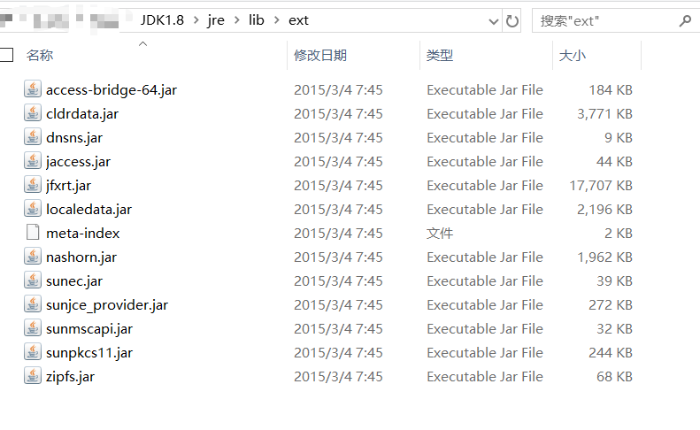
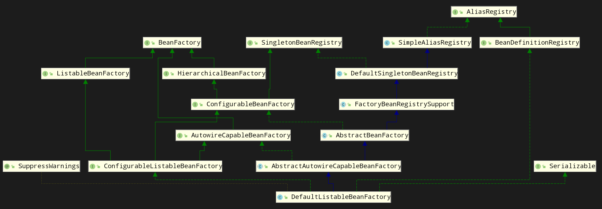
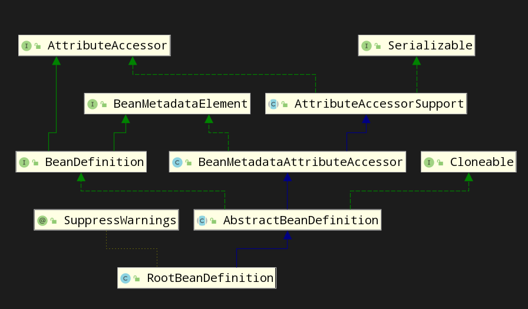
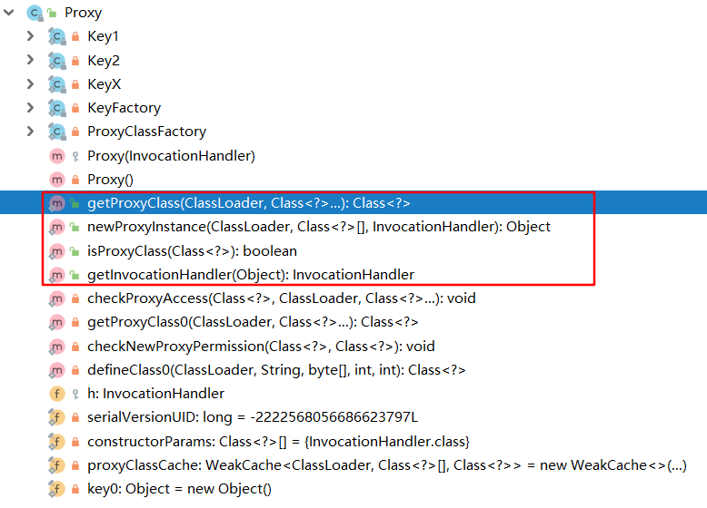

# 第6章 深入分析ClassLoader工作机制

三个作用：

1. 将Class加载到JVM中；
2. 审查每个类应该由谁加载（双亲委派）；
3. 将CLass字节码重新解析成JVM统一要求的格式。

## 6.1 ClassLoader类结构解析

defineClass方法：将byte字节流解析成JVM能够识别的Class对象。意味着不仅仅可以通过class文件实例化对象。调用此方法生成的Class对象还没有resolve，resolve会在对象真正实例化时才进行。

findClass方法：通过直接覆盖ClassLoader父类的findClass方法来实现类的加载规则，从而取得要加载的字节码。然后调用defineClass方法生成类的Class对象。如果想在类被加载到JVM的时候就被链接（Link），那么可以接着调用另外一个resolveClass方法。

如果想实现自己的ClassLader，一般都会继承URLClassLoader。

## 6.2 ClassLoader的等级加载机制

双亲委派。

（1）Bootstrap ClassLoader，主要加载JVM自身工作需要的类，完全由JVM自己控制。（既没有更高一级的父加载器，也没有子加载器）。

（2）ExtClassLoader，并不是JVM亲自实现，加载System.getProperty(“java.ext.dirs”)目录下的类。

（3）AppClassLoader，父类是ExtClassLoader。加载System.getProperty(“java.class.path”)目录下的类都可以被其加载。

实现自己的类加载器，都必须最终调用getSystemClassLoader()作为父加载器。而此方法获取到的就是AppClassLoader。

注意Bootstrap ClassLoader并不是如其他文章所说，而是其并无子类也无父类。ExtClassLoader并没有父类加载器。

ExtClassLoader和AppClassLoader都继承了URLClassloader类，而URLClassLoader又实现了抽象类ClassLoader，在创建Launcher对象时会首先创建ExtClassLoader，然后讲ExtClassLoader对象作为父加载器创建AppClassLoader对象。所以如果在Java应用中没有定义其他的ClassLoader，那么除了System.getProperty(“java.ext.dirs”)目录下的类是由ExtClassloader加载，其他类都是由AppClassLoader加载。

加载class文件到内存的两种方式：隐式，显式。

## 6.3 如何加载class文件

加载、验证、准备、解析、初始化。

# 第13章 Spring框架的设计理念与设计模式分析

## 13.1 Spring的骨骼架构

三个核心组件：Core、Context和Bean。

### 13.1.1 Spring的设计理念

最核心：Bean。（面向Bean编程）

解决了一个关键问题：把对象之间的依赖关系转而用配置文件来管理（依赖注入）。

Spring通过把对象包装在Bean中，从而达到管理这些对象及做一系列额外操作的目的。

这种设计策略完全类似于OOP的设计理念。构建一个数据结构，然后根据这个数据结构设计它的生存环境，并让它在这个环境中按照一定的规律不停地运动，在它们地不停运动中设计一个系列于环境或者与其他各地完成信息交换。（同时也是大多数框架地设计理念）

### 13.1.12 核心组件如何协同工作

Context负责发现每个Bean之间的关系，建立关系并且维护关系。所以Context就是一个Bean关系的集合，也叫Ioc容器。

Core就是发现、建立和维护每个Bean之间的关系所需要的一系列工具。（也就是一些Util）

## 13.2 核心组件详解

### 13.2.1 Bean组件

包：org.springframework.beans。这个包下的类主要解决三件事：Bean的定义、Bean的创建及对Bean的解析。（使用者只需关心创建）

Spring是典型的工厂模式，工厂的继承层次关系图如下：

顶级接口BeanFactory有3个子接口：ListableBeanFactory、HierarchicalBeanFantory和AutowireCapableBeanFactory。

DefaultListableBeanFactory实现了所有的结构。

定义多接口的原因：每个接口有不同的使用场景，主要是为了区分Spring内部对象的传递和转化过程中，对对象的数据访问所作的限制。例如，ListableBeanFactory接口标识这些Bean是可列表的，HierarchicalBeanFactory表示这些Bean是有继承关系的，AutowireCapableBeanFactory接口定义Bean的自动装配规则。4个接口共同定义了Bean的集合、Bean之间的关系和Bean的行为。

Bean的定义主要有Beandefinition描述：

Bean是配置文件信息中\<bean/>节点信息的转化。Spring解析完成后，内部就是一个BeanDefinition对象。

Bean的解析过程过于繁琐，不赘述。

### 13.2.2 Context组件

ApplicationContext继承了BeanFactory。

ApplicationContext的子类主要包含两个方面：

- ConfigurableApplicationContext表示该Context是可修改的，也就是构建Context中，用户可以动态添加或修改已有的配置信息。
- WebApplication，用于Web，可以直接访问Servletcontext。

ApplicationContext必须完成的事情：

- 标识一个应用环境
- 利用BeanFactory创建Bean对象
- 保存对象关系表
- 能够捕获各种事件

### 13.2.3 Core组件

其中有很多关键类，一个重要的组成部分就是定义了资源的访问方式。

Resource类相关：封装了各种可能的资源类型，也就是说对使用者来说屏蔽了文件类型的不同。通过继承InputStreamSource接口，在这个接口中有个getInputStream方法，返回InputStream类，所有资源都可以通过InputStream来获取，及屏蔽了资源的提供者。

Context把资源的加载、解析和描述工作委托给了ResourcePatternResolver类来完成。

### 13.2.4 Ioc容器如何工作

1. 如何创建BeanFactory工厂

refresh方法。源码已阅就不贴了。步骤如下：

（1）构建BeanFactory

（2）注册可能感兴趣的事件

（3）创建Bean实例对象

（4）出发被监听的事件

2. 如何创建Bean实例并构建Bean的关系网

详见源码。

3. Ioc容器的扩展点

BeanFactoryPostProcessor和BeanPostProcessor，分别在构建BeanFactory和构建Be'an对象时调用。还有就是InitPostProcessor和DisposableBean，它们分别在Bean实例创建和销毁时被调用。用户可以实现在这些接口中定义的方法，Spring会在适当的时候调用他们。还有一个是FactoryBean。（会扩展是精通Spring的第一步）

4. Ioc容器如何为我所用

扩展点。通过扩展点来改变Spring的通用行为。（AOP是一个例子，可以作为参考）

## 13.3 Spring中AOP的特性详解

### 13.3.1 动态代理的实现原理

java.lang.reflect.Proxy。

重点看公有方法。

阅读源码部分略。

### 13.2.2 Spring AOP如何实现

## 13.4 设计模式解析之代理模式

给某一个对象创建一个代理对象，有代理对象控制对原对象的引用，而创建代理对象之后可以再调用时增加一些额外的操作。

## 13.5 设计模式解析之策略模式

CGLIB与JDK动态代理的选择，就是策略模式的一种实现。