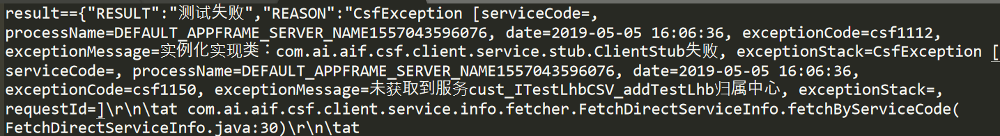
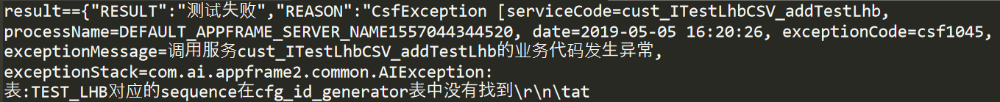
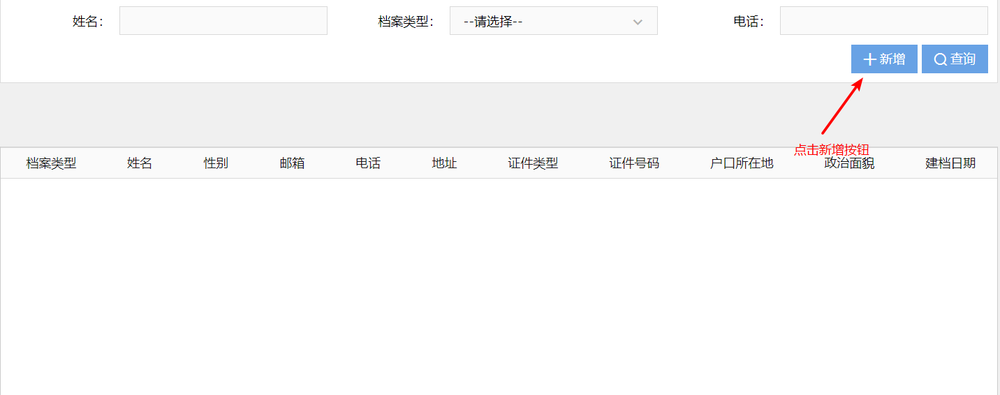
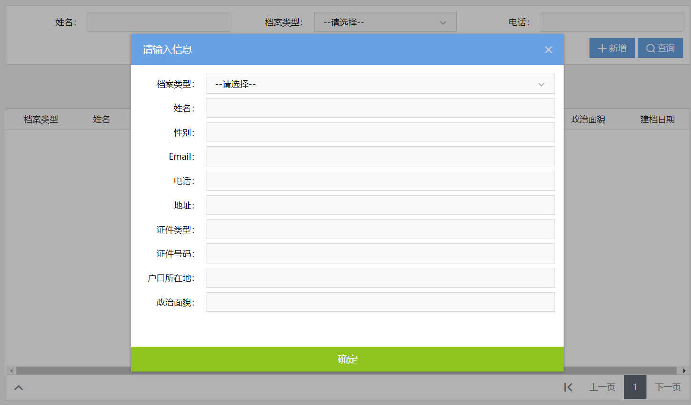
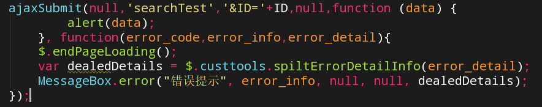
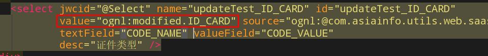
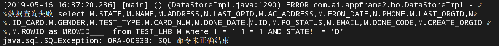

# 4月22

## 一、项目下载（修改host文件）

地址：


修改如下：

```
10.5.1.26   cddev26
10.5.1.24   cddev24
10.5.1.25   cddev25
10.5.1.27   cddev27
10.5.1.23   cddev23
10.5.1.22   cddev22
10.5.1.21   cddev21
10.5.1.49   cddev49
10.5.1.50   cddev50


10.5.1.26 bjsvn
10.5.1.27 ssotest.crm.bmcc.com.cn
10.5.1.27 cstest.crm.bmcc.com.cn
10.5.1.27 csuat.crm.bmcc.com.cn
10.5.1.27 bjenv
10.5.1.27 ciserver
10.5.1.26 cdwiki

#开发环境Redis服务器
10.5.1.25 redisserver
#开发环境Zk服务器
10.5.1.25 zkserver
#csf远端服务器
10.5.1.26 csfdevserver
#cau服务器
10.5.1.49 causerver
10.7.5.58 caunewserver
```


配置号host文件后从gitlab克隆，就可以下载项目了。


## 二、配置数据库

下载PLSQL（类似于NIVCAT的连接工具，只是连接的是ORACLE数据库）

配置TNS，（改名字然后复制粘贴到instantclient_11_2目录下）。

配置**环境变量**

```
 TNS_ADMIN = D:PLSQL\instantclient_11_2
```

配置自启动文件

## 三、IDEA

用jetbrains-agent.jar包进行破解，具体如下：


.jpg)

.jpg)

.jpg)

## 四、客户管理业务培训PPT学习

1.三户模型 客户、用户、账户

2.三户关系

3.个人客户与集团客户区分

4.客户实名制 实名制登记

5.贵宾客户

## 五、开发指导手册

1.git的使用（已掌握）

2.开发指导（暂未掌握）

## 六、CRM-总体介绍-北京CRM系统概

什么是CRM？

客户关系模型

了解CRM包括的功能

了解CRM的技术体系

了解CRM的网络部署

了解CRM和其他外围系统的集成关系

## 七、项目导入

出现各种BUG

1.maven 配置文件更换

```
<?xml version="1.0" encoding="UTF-8"?>
<settings xmlns="http://maven.apache.org/SETTINGS/1.0.0"
          xmlns:xsi="http://www.w3.org/2001/XMLSchema-instance"
          xsi:schemaLocation="http://maven.apache.org/SETTINGS/1.0.0 http://maven.apache.org/xsd/settings-1.0.0.xsd">
  <mirrors>
    <mirror>
        <id>asiainfo-Dev</id>
        <name>nexus maven</name>
        <url>http://10.5.1.27:8081/repository/bjcrm-dev/</url>
        <mirrorOf>*</mirrorOf>
    </mirror>
  </mirrors>
  <profiles>    
    <profile>    
        <id>nexus</id>
        <pluginRepositories>
         <pluginRepository>    
                <id>nexus-releases</id>    
                 <url>http://10.5.1.27:8081/repository/CentralGroup/</url>
                 <releases><enabled>true</enabled></releases>    
                 <snapshots><enabled>true</enabled></snapshots>    
               </pluginRepository>    
               <pluginRepository>    
                 <id>nexus-snapshots</id>    
                  <url>http://10.5.1.27:8081/repository/CentralGroup/</url>
                <releases><enabled>true</enabled></releases>    
                 <snapshots><enabled>true</enabled></snapshots>    
             </pluginRepository>    
         </pluginRepositories>    
    </profile>    
  </profiles>  
  <activeProfiles>    
      <activeProfile>nexus</activeProfile>    
  </activeProfiles>  
  <localRepository>F:\maven_repository</localRepository>
</settings>

```

2.IDEAsetting中编译环境配置


# 4月23

## 一、查询CSF

```
-- 查询菜单
SELECT * FROM SEC.SEC_FUNCTION T WHERE T.NAME = '客户信息管理';

-- 菜单
-- /crm-cust/web-cust/src/main/webapp/WEB-INF/cust.application

-- CSF
SELECT T.* FROM CSF.CSF_SRV_SERVICE_INFO T WHERE T.SERVICE_CODE = 'cust_ICustomerCSV_queryUnifyCustomers';
SELECT T.* FROM CSF.CSF_SRV_SERVICE_PARAM T WHERE T.SERVICE_CODE = 'cust_ICustomerCSV_queryUnifyCustomers';
SELECT T.* FROM CSF.CSF_REGISTERBYCODE_INFO T WHERE T.SERVICE_CODE = 'cust_ICustomerCSV_queryUnifyCustomers';
```

## 二、创建表

```sql
CREATE TABLE TEST_LHB(
    
    FUNC_ID      NUMBER(8) not null,
    ENT_CLASS_ID NUMBER(12),
    FUNC_CODE    VARCHAR2(80),
    NAME         VARCHAR2(80) not null,
    DOMAIN_ID    NUMBER(12),
    NOTES        VARCHAR2(100),
    PARENT_ID    NUMBER(12) not null,
    FUNC_LEVEL    NUMBER(2),
    FUN_SEQ       NUMBER(3),
    VIEWNAME      VARCHAR2(1000),
    DLL_PATH      VARCHAR2(1000),
    FUNC_IMG      VARCHAR2(1000),
    FUNC_ARG      VARCHAR2(1000),
    FUNC_TYPE     CHAR(1),
    VERIFY_MODE   VARCHAR2(20),
    LOGIN_MODE    NUMBER(4),
    BUSI_TYPE     NUMBER(4),
    BUSI_SCENE    NUMBER(4),
    MODULE_TYPE   NUMBER(3),
    MODULE_ENT_ID NUMBER(8),
    HELP_URL      VARCHAR2(100),
    ENTRANCE      NUMBER(4),
    DISP_TYPE     NUMBER(4),
    AUDIT_LEVEL   NUMBER(4),
    AUDIT_FLAG    NUMBER(4),
    STATE         NUMBER(2),
    EXT1          VARCHAR2(20),
    EXT2          VARCHAR2(20),
    DONE_CODE     NUMBER(12),
    CREATE_DATE   DATE,
    DONE_DATE     DATE,
    VALID_DATE    DATE,
    EXPIRE_DATE   DATE,
    OP_ID         NUMBER(12),
    ORG_ID        NUMBER(12)
)
```

表的位置：75 party库

遇到的问题：oracle创建删除表

##  三、使用appframe创建BO文件

遇到BUG：非法字符，JDK版本问题，修改版本然后重启。

生成bo，接口，实现类。

将生成的文件分类别放到不同包下


## 四、创建表（二）

建表规范：

```sql
-- Create table
create table party.INDUSTRY_COMMERCE_BIG_DATA
(
  id                       NUMBER(14) not null,
  unify_social_credit_code VARCHAR2(50) not null,
  cust_name                VARCHAR2(50),
  registered_capital       VARCHAR2(50),
  legal_person             VARCHAR2(50),
  registered_address       VARCHAR2(50),
  ext1                     VARCHAR2(50),
  ext2                     VARCHAR2(50),
  ext3                     VARCHAR2(50)
)
tablespace RMTEST_DATA
  pctfree 10
  initrans 1
  maxtrans 255
  storage
  (
    initial 512K
    next 512K
    minextents 1
    maxextents unlimited
    pctincrease 0
  );
-- Add comments to the columns 
comment on column party.INDUSTRY_COMMERCE_BIG_DATA.id
  is '主键';
comment on column party.INDUSTRY_COMMERCE_BIG_DATA.unify_social_credit_code
  is '统一社会信用代码证';
comment on column party.INDUSTRY_COMMERCE_BIG_DATA.cust_name
  is '客户名称';
comment on column party.INDUSTRY_COMMERCE_BIG_DATA.registered_capital
  is '注册资金';
comment on column party.INDUSTRY_COMMERCE_BIG_DATA.legal_person
  is '法人';
comment on column party.INDUSTRY_COMMERCE_BIG_DATA.registered_address
  is '注册地址';
-- Create/Recreate indexes 
create index UNIFY_SOCIAL_CREDIT_CODE on party.INDUSTRY_COMMERCE_BIG_DATA (UNIFY_SOCIAL_CREDIT_CODE)
  tablespace RMTEST_DATA
  pctfree 10
  initrans 2
  maxtrans 255
  storage
  (
    initial 512K
    next 512K
    minextents 1
    maxextents unlimited
    pctincrease 0
  );
-- Create/Recreate primary, unique and foreign key constraints 
alter table party.INDUSTRY_COMMERCE_BIG_DATA
  add constraint PK_SQID primary key (ID)
  using index 
  tablespace RMTEST_DATA
  pctfree 10
  initrans 2
  maxtrans 255
  storage
  (
    initial 512K
    next 512K
    minextents 1
    maxextents unlimited
    pctincrease 0
  );
  
-- Create sequence update by 1
create sequence PARTY.INDUSTRY_COMMERCE_BIG_DATA$SEQ
minvalue 1
maxvalue 999999999999
start with 100001
increment by 1
cache 200;

```


```
CREATE TABLE PARTY.TEST_LHB(
    ID         NUMBER(20) not null,
    TYPE       VARCHAR2(10) not null,
    NAME       VARCHAR2(20) not null,
    GENDER     VARCHAR2(10) not null,
    EMAIL      VARCHAR2(100),
    PHONE      VARCHAR2(50),
    ADDRESS    VARCHAR2(200),
    ID_CARD    VARCHAR2(30),
    CARD_NUM   VARCHAR2(30),
    AC_ADDRESS VARCHAR2(10),
    PO_STATUS  VARCHAR2(10),
    FROM_DATE  DATE,
    PRIMARY KEY(ID)

);
```

# 4月24

## 一、生成BO、BEAN、ENGINE、接口

选择数据表


生成BO后进入业务对象Bean页面


遇到BUG，创建表时用到TYPE字段与Java冲突出现报错，修改TYPE为TEST_TYPE。

## 二、查询实现类编写

代码如下：

```java
package com.asiainfo.datacenter.cust.test.dao.impl;

import com.asiainfo.datacenter.cust.test.bo.BOTestLhbBean;
import com.asiainfo.datacenter.cust.test.ivalues.IBOTestLhbValue;
import com.asiainfo.utils.common.DBEngineUtil;

import java.util.Map;

public class TestLhbDAOimpl {

    public IBOTestLhbValue[] queryALL(Map input) throws Exception{
        return DBEngineUtil.getBeans(BOTestLhbBean.class,BOTestLhbBean.getObjectTypeStatic(),input);
    }
}
```

实现类生成接口：


## 三、DAO层、service层、CFS接口、测试

参照代码操作

遇到BUG：需要保证所有文件编码格式都为 UTF-8

# 4月25

## 一、测试

如果代码没问题，出现问题一般是连接问题，需要检查defaults.xml配置文件

几个RESULT_INFO的转换API：

> Value转Map使用PartUtil.transformBo()或者PartUtil.parseToMap()都可以。
> Value数组转List-Map用PartTool.beanToList()
> Bean数组转List-Map用PartUtil.toList()
> Map转value用PartUtil.toBo

RESULT_INFO是的vaule大多是一个List。

## 二、前端框架

cust.application中添加

```page
    <!-- 测试查询 -->
    <page name="Test_Lhb.Testlhb" specification-path="/Test_Lhb/Testlhb.page" version="1"/>
```


### 1.page文件

### 2.html

### 3.java文件

### 4.js

同名js必须带的初始化函数：

```javascript
$(function(){
    Wade.setRatio();
    MessageBox.fullMode = false;//设置为非全屏模式
    MessageBox.showDetail = false;//默认是否展示错误详情。默认为显示
    
});
```

遇到的BUG ：

> page文件的编码需要设置，值为“UTF-8”
>
> java文件需要继承Page类
>
> 配置IDEA热部署：修改服务器配置，使得IDEA窗口失去焦点时，更新类和资源
>
> 菜单Run -> EditConfiguration , 然后配置指定服务器下，右侧server标签下on frame deactivation = Update classes and resource。
>
> 优点：简单
>
> 缺点：基于JVM提供的热加载仅支持方法块内代码修改，只有debug模式下，并且是在idea失去焦点时才会出发热加载，相对加载速度缓慢

# 4月26

## 一、根据表结构规划前端页面需要展示的内容


## Demo需求：

> 查询条件
> 
> 姓名 模糊查询 NOT NULL 
> 1. 姓名不为空来查
> 2. 姓名为空，其他必须输入
>
> 档案类型 下拉框 
>
> 电话 精确查询

## 二、界面下拉框的枚举值展示

缓存查询：

```SQL
SELECT * FROM base.Bs_Static_Data t WHERE t.Code_Type = 'CM_CERT_TYPE';
```

即需要通过下拉框展示的需要在BS_STATIC_DATA库中加入即可实现。


```sql
INSERT INTO base.BS_STATIC_DATA(code_type,code_value,code_name,code_desc,code_type_alias,sort_id,state,extern_code_type) VALUES('LHB_TEST_TYPE','1','转正','档案类型','LHB_TEST_TYPE',1,'U','');
INSERT INTO base.BS_STATIC_DATA(code_type,code_value,code_name,code_desc,code_type_alias,sort_id,state,extern_code_type) VALUES('LHB_TEST_TYPE','2','离职','档案类型','LHB_TEST_TYPE',2,'U','');
INSERT INTO base.BS_STATIC_DATA(code_type,code_value,code_name,code_desc,code_type_alias,sort_id,state,extern_code_type) VALUES('LHB_TEST_TYPE','3','调岗','档案类型','LHB_TEST_TYPE',3,'U','');
INSERT INTO base.BS_STATIC_DATA(code_type,code_value,code_name,code_desc,code_type_alias,sort_id,state,extern_code_type) VALUES('LHB_TEST_TYPE','4','续签','档案类型','LHB_TEST_TYPE',4,'U','');
INSERT INTO base.BS_STATIC_DATA(code_type,code_value,code_name,code_desc,code_type_alias,sort_id,state,extern_code_type) VALUES('LHB_TEST_TYPE','5','调薪','档案类型','LHB_TEST_TYPE',5,'U','');
INSERT INTO base.BS_STATIC_DATA(code_type,code_value,code_name,code_desc,code_type_alias,sort_id,state,extern_code_type) VALUES('LHB_TEST_TYPE','6','其他变更','档案类型','LHB_TEST_TYPE',6,'U','');


SELECT *FROM base.BS_STATIC_DATA t WHERE t.code_type='LHB_TEST_TYPE';
```

遇到的问题：

插入之后添加需要commit才能提交。


# 4月28

遇到问题：上次删除数据没有commit，但是插入的时候提交了。

```sql
SELECT * FROM base.BS_STATIC_DATA t WHERE t.code_type='LHB_TEST_TYPE';

DELETE FROM base.BS_STATIC_DATA t WHERE t.code_type='LHB_TEST_TYPE';
COMMIT;

INSERT INTO base.BS_STATIC_DATA(code_type,code_value,code_name,code_desc,code_type_alias,sort_id,state,extern_code_type) VALUES('LHB_TEST_TYPE','1','转正','档案类型','LHB_TEST_TYPE',1,'U','');
INSERT INTO base.BS_STATIC_DATA(code_type,code_value,code_name,code_desc,code_type_alias,sort_id,state,extern_code_type) VALUES('LHB_TEST_TYPE','2','离职','档案类型','LHB_TEST_TYPE',2,'U','');
INSERT INTO base.BS_STATIC_DATA(code_type,code_value,code_name,code_desc,code_type_alias,sort_id,state,extern_code_type) VALUES('LHB_TEST_TYPE','3','调岗','档案类型','LHB_TEST_TYPE',3,'U','');
INSERT INTO base.BS_STATIC_DATA(code_type,code_value,code_name,code_desc,code_type_alias,sort_id,state,extern_code_type) VALUES('LHB_TEST_TYPE','4','续签','档案类型','LHB_TEST_TYPE',4,'U','');
INSERT INTO base.BS_STATIC_DATA(code_type,code_value,code_name,code_desc,code_type_alias,sort_id,state,extern_code_type) VALUES('LHB_TEST_TYPE','5','调薪','档案类型','LHB_TEST_TYPE',5,'U','');
INSERT INTO base.BS_STATIC_DATA(code_type,code_value,code_name,code_desc,code_type_alias,sort_id,state,extern_code_type) VALUES('LHB_TEST_TYPE','6','其他变更','档案类型','LHB_TEST_TYPE',6,'U','');
COMMIT;
```

AJAX：


PLSQL直接修改数据：


# 4月29

## 一、DEBUG——Java

CSF返回的类型到底是map还是list，会导致在.java文件中解析的情况不同。

## 二、重新读一遍代码并且添加注释

项目步骤：

> 1、分析需求，建表
>
> 2、用工具生成BO文件，并生成Bean.java、Engine.java、Value.java(接口)
>
> datacenter文件夹下：
>
> 3、DAO层，因为目前只做了查询，传入一个Map，然后调用com.asiainfo.utils.common.DBEngineUtil进行数据处理，只能做拼接SQL语句。
>
> 4、Service层，对DAO层的封装，业务实现在DAO层，Service只能看到有哪些方法。
>
> busi文件夹下：
>
> 5、CSV层，业务逻辑层，调用Service层来实现业务逻辑，Demo只是将查询出的Value数组放入Map
>
> 6、用工具注册CSF接口
>
> 
>
> 
>
> 以上步骤完成后，应该明确直到传入的值和传出的值，特别是传出值的类型（Map还是List？）
>
> web-cust文件夹下：
>
> 7、前端页面布局编写，按照需求分析，避免重新更改数据库。
>
> 额外：下拉框等来自缓存库，需要提前在缓存库中添加数据，以便能够一开始就能显示下拉框等的值。
>
> 8、JS编写，Ajax特别需要注意各个参数的意义。其中：第一个属性是提交域，第二个属性需要与Java文件中的方法名字相同，第四个属性是返回域。
>
> Java文件写到java文件夹下，page文件与html放到一起。
>
> 9、JS调用的Java文件，与page文件的联系目前暂时没看懂，但是需要知道：开头的抽象方法传入的参数需要在page文件中注册。
>
> 10、Java文件负责处理请求，即读取请求中的参数，然后调用CSF接口并且传入参数，解析返回值，用一开头的抽象setxxxx方法返回。
>
> 11、page文件中需要写出Java中返回的值的名字和类型。
>
> 12、最后在保证代码没问题的情况下可实现正常运行。

# 4月30

遇到BUG：
no further information

这个进程掉了：


## 一、无入参查询所有

在input前加if,判断是否有值后再put，否则会添加了键而无值导致异常。

## 二、分页查询

先再数据库中插入多条数据。

遇到问题1：之前建立的序列名忘了，用以下语句查询：

```plsql
SELECT * FROM USER_SEQUENCES T WHERE T.SEQUENCE_NAME LIKE '%TEST%';
```

没有查出来，只能重新创建序列：

```plsql
CREATE sequence PARTY.INDUSTRY_COMMERCE_BIG_DATA$SEQ
minvalue 1
maxvalue 999999999999
start with 100001
increment by 1
cache 200;
```

插入：

```PLSQL
INSERT INTO party.test_lhb t (t.ID,t.TEST_TYPE,t.NAME,t.GENDER,t.ID_CARD,t.CARD_NUM,t.FROM_DATE)
VALUES (party.test_lhb$seq.nextval,'转正','a','男','身份证','46513213',SYSDATE);
```


参照：CmUserRealNameHis（<!--用户实名联系人修改历史查询-->）

遇到问题2，查询按钮传入的参数和点击下一页传入的参数有区别，需要在Java文件中考虑多种情况，我遇到的是需要将：

```java
if ("" != Name) {
            input.put("NAME",Name);
}
```

改为：

```JAVA
if ("" != Name && null != Name) {
            input.put("NAME",Name);
}
```

遇到问题3：

提交域不一致的问题，与上一个问题类似，需要修改分页中的cond属性、查询提交的part、Ajax的第一个属性，这个三个属性保持一致。

# 5月5号

## 一、编写DAO层、Service层

遇到问题：由于添加会用到ID，发现bo文件中的ID是String型，之前修改表结构未同步BO文件导致的问题。

## 二、CSV层

由于对参考的代码的业务逻辑不了解，只能自己编写。

## 三、测试后端部分


第一次报错：



未获取到服务，去数据库查询发现CSF接口的状态为W，改为U之后再次测试。

第二次报错：



~~应该是未添加主键，而Oracle无法实现主键自增长导致的错误。~~

需要在**base库**下的cfg_id_generator表中添加需要操作的表，及其对应的序列。

bean转为Map应该调用parsetomap()方法。

最后一个问题：ID是从48开始的，应该是28，应该是之前调试的过程中导致序列增长。

# 5月7号

## 一、考虑事务并发带来的问题

丢失修改，藏独，不可重复读，幻读

之前遇到的Oracle与MySQL提交不一样的问题，即Oracle与MySQL的事务处理级别不同，MySQL

默认的事务处理级别时‘REPEATABLE-READ’，也就是可重复读，会导致脏读、幻读、或不可重复读。

##  二、测试csf接口能不能用

之前是把CSF当作服务来调用

## 三、完成添加信息的窗口弹出

效果如下：



弹出窗口：



# 5月9号

## 一、修改静态数据的来源

## 二、完善查询功能

## 三、增加查询为空的页面提示

## 四、清空表单

```js
resetArea(areaId, clean);
```

# 5月10

## 一、更新与删除后端编写

## 二、CSF接口编写及测试

遇到问题：添加时间

# 5月13

## 一、注册csf接口之后再测试

测试成功，但是有个问题是，更新之前先查询出应该是一条数据，但是控制台显示了所有数据

## 二、前端代码编写

想了三种形式，方案一是通过点击数据实现弹出窗口然后修改信息

方案二是勾选数据然后点击修改按钮通过弹出层修改信息

方案三是双击数据之后通过ID再次查询数据并加载弹出层后修改，然后提交结果

## 三、关于修改的一些实现细节

查询的时候应该将ID一并传出然后在修改页面中通过传出ID再次查询再进行修改。

遇到问题：将表格中的一个列隐藏？为实现，先做需求等会儿做 **class=”e_hide”**

## 四、分布完成 用查询结果刷新待修改区域；

将ID通过ajax的第三个参数提交：



# 5月14

## 一、编写CSF接口，注册，测试

通过ID查询出一条数据，返回为Map;

遇到问题：CSF接口返回必须是Map或者void；

## 二、实现将待修改的数据在前端显示

遇到问题：下拉框的刷新


需要用这个属性实现


## 三、提交修改

遇到问题：

但还是有问题，必须要修改，否则值为空；

虽然显示了刷新后的下拉栏，但是还是必须选择下拉栏，不然会传入空值；

## 四、关闭窗口后刷新


## 五、在查询功能中增加筛选

如果STATE为D则删除，需要使用迭代器，不太会用。。。

查资料后并不能操作IDataSet，也就是在.java中不能操作，只能在CSF中操作List<Map<String,Object>>

# **优化**：

1、查询结果加序列

2、 弹出层中的性别用switch开关

3、证件号码做限制，对应证件类型，电话，email

4、地址大于8个中文

5、修改成功后弹出层自动隐藏

6、成功和失败的提示框用messagebox

7、新增和修改做成一个弹出层


# 5月15

## 一、完善弹出层下拉框

尝试用js去实现，但是都没成功；

最后：



即可实现刷新。

## 二、将逻辑删除的数据从返回的结果集中删除

遇到问题，将数据库中的CHAR类型的列修改为VARCHAR2后会在数据后面自动加上空格，导致在Java后台中查不出结果。

## 三、编写删除接口并测试

# 5月16

## 一、增加选择栏

## 二、重写查询接口并测试


遇到问题：



阅读DBEngineUtile源码

找到问题如下：

```SQL
select M.STATE,M.NAME,M.ADDRESS,M.LAST_OPID,M.AC_ADDRESS,M.FROM_DATE,M.PHONE,M.LAST_ORGID,M.ID_CARD,M.GENDER,M.TEST_TYPE,M.CARD_NUM,M.DONE_DATE,M.ID,M.PO_STATUS,M.EMAIL,M.DONE_CODE,M.CREATE_ORGID ,M.ROWID as MROWID___  from TEST_LHB M where 1 = 1 AND STATE！ = 'D'；
```

STATE!=“D”只会查出STATE字段不为空的数据，若STATE为空还是不会显示，所以只能手动添加。

